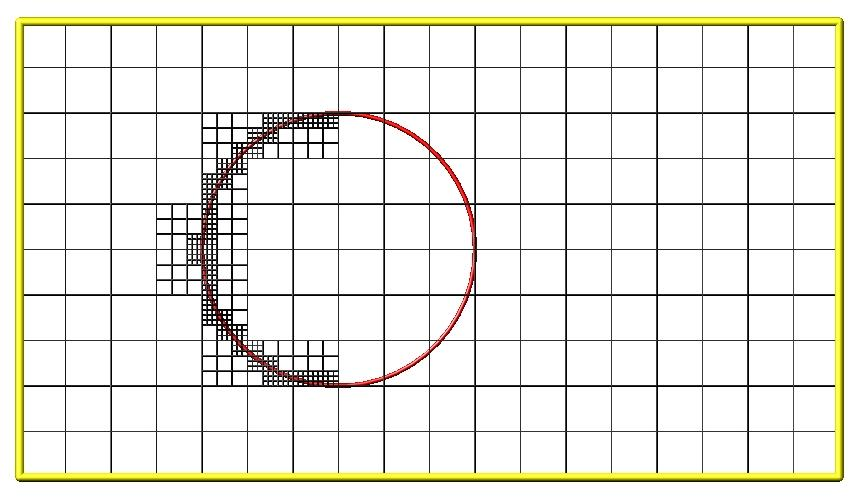

6. How-to discussions
=====================

The following sections describe how to perform common tasks using
SPARTA, as well as provide some techinical details about how
SPARTA works.

| 6.1 `2d simulations <#howto_1>`_
| 6.2 `Axisymmetric simulations <#howto_2>`_
| 6.3 `Running multiple simulations from one input script <#howto_3>`_
| 6.4 `Output from SPARTA (stats, dumps, computes, fixes, variables) <#howto_4>`_
| 6.5 `Visualizing SPARTA snapshots <#howto_5>`_
| 6.6 `Library interface to SPARTA <#howto_6>`_
| 6.7 `Coupling SPARTA to other codes <#howto_7>`_ 
| 6.8 `Details of grid geometry in SPARTA <#howto_8>`_
| 6.9 `Details of surfaces in SPARTA <#howto_9>`_
| 6.10 `Restarting a simulation <#howto_10>`_
| 6.11 `Using the ambipolar approximation <#howto_11>`_
| 6.12 `Using multiple vibrational energy levels <#howto_12>`_
| 6.13 `Surface elements: explicit, implicit, distributed <#howto_13>`_
| 6.14 `Implicit surface ablation <#howto_14>`_
| 6.15 `Transparent surface elements <#howto_15>`_
| 6.16 `Visualizing SPARTA output with ParaView <#howto_16>`_
| 6.17 `Custom per-particle, per-grid, per-surf attributes <#howto_17>`_
| 6.18 `Variable timestep simulations <#howto_18>`_
| 6.19 `Details of particles in SPARTA <#howto_19>`_ 
| 

The example input scripts included in the SPARTA distribution and
highlighted in :doc:`Section 5 <Section_example>` of the manual also
show how to setup and run various kinds of simulations.

.. _howto_1:

.. raw:: html

   

6.1 2d simulations
------------------

In SPARTA, as in other DSMC codes, a 2d simulation means that
particles move only in the xy plane, but still have all 3 xyz
components of velocity.  Only the xy components of velocity are used
to advect the particles, so that they stay in the xy plane, but all 3
components are used to compute collision parameters, temperatures,
etc.  Here are the steps to take in an input script to setup a 2d
model.

* Use the :doc:`dimension <dimension>` command to specify a 2d simulation.
* Make the simulation box periodic in z via the :doc:`boundary <boundary>`
  command.  This is the default.
* Using the :doc:`create box <create_box>` command, set the z boundaries
  of the box to values that straddle the z = 0.0 plane.  I.e. zlo < 0.0
  and zhi > 0.0.  Typical values are -0.5 and 0.5, but regardless of the
  actual values, SPARTA computes the "volume" of 2d grid cells as if
  their z-dimension length is 1.0, in whatever :doc:`units <units>` are
  defined.  This volume is used with the :doc:`global nrho <global>`
  setting to calculate numbers of particles to create or insert.  It is
  also used to compute collision frequencies.
* If surfaces are defined via the :doc:`read\_surf <read_surf>` command,
  use 2d objects defined by line segements.

Many of the example input scripts included in the SPARTA distribution
are for 2d models.

----------

.. _howto_2:

.. raw:: html

   

6.2 Axisymmetric simulations
----------------------------

In SPARTA, an axi-symmetric model is a 2d model.  An example input
script is provided in the examples/axisymm directory.

An axi-symmetric problem can be setup using the following commands:

* Set dimension = 2 via the :doc:`dimension <dimension>` command.
* Set the y-dimension lower boundary to "a" via the :doc:`boundary <boundary>` command.
* The y-dimension upper boundary can be anything except "a" or "p" for periodic.
* Use the :doc:`create\_box <create_box>` command to define a 2d simulation box with ylo = 0.0.

If desired, grid cell weighting can be enabled via the :doc:`global weight <global>` command.  The *volume* or *radial* setting can be
used for axi-symmetric models.

Grid cell weighting affects how many particles per grid cell are
created when using the :doc:`create\_particles <create_particles>` and
:doc:`fix emit <fix_emit_face>` command variants.

During a run, it also triggers particle cloning and destruction as
particles move from grid cell to grid cell.  This can be important for
inducing every grid cell to contain roughly the same number of
particles, even if cells are of varying volume, as they often are in
axi-symmetric models.  Note that the effective volume of an
axi-symmetric grid cell is the volume its 2d area sweeps out when
rotated around the y=0 axis of symmetry.

----------

.. _howto_3:

.. raw:: html

   

6.3 Running multiple simulations from one input script
------------------------------------------------------

This can be done in several ways.  See the documentation for
individual commands for more details on how these examples work.

If "multiple simulations" means continue a previous simulation for
more timesteps, then you simply use the :doc:`run <run>` command
multiple times.  For example, this script

.. parsed-literal::

   read_grid data.grid
   create_particles 1000000
   run 10000
   run 10000
   run 10000
   run 10000
   run 10000

would run 5 successive simulations of the same system for a total of
50,000 timesteps.

If you wish to run totally different simulations, one after the other,
the :doc:`clear <clear>` command can be used in between them to
re-initialize SPARTA.  For example, this script

.. parsed-literal::

   read_grid data.grid
   create_particles 1000000
   run 10000
   clear
   read_grid data.grid2
   create_particles 500000
   run 10000

would run 2 independent simulations, one after the other.

For large numbers of independent simulations, you can use
:doc:`variables <variable>` and the :doc:`next <next>` and
:doc:`jump <jump>` commands to loop over the same input script multiple
times with different settings.  For example, this script, named
in.flow

.. parsed-literal::

   variable d index run1 run2 run3 run4 run5 run6 run7 run8
   shell cd $d
   read_grid data.grid
   create_particles 1000000
   run 10000
   shell cd ..
   clear
   next d
   jump in.flow

would run 8 simulations in different directories, using a data.grid
file in each directory.  The same concept could be used to run the
same system at 8 different gas densities, using a density variable and
storing the output in different log and dump files, for example

.. parsed-literal::

   variable a loop 8
   variable rho index 1.0e18 4.0e18 1.0e19 4.0e19 1.0e20 4.0e20 1.0e21 4.0e21
   log log.$a
   read data.grid
   global nrho ${rho}
   ...
   compute myGrid grid all all n temp
   dump 1 grid all 1000 dump.$a id c_myGrid
   run 100000
   clear
   next rho
   next a
   jump in.flow

All of the above examples work whether you are running on 1 or
multiple processors, but assumed you are running SPARTA on a single
partition of processors.  SPARTA can be run on multiple partitions via
the "-partition" command-line switch as described in `Section 2.5 <Section_start.html#start_7>`_ of the manual.

In the last 2 examples, if SPARTA were run on 3 partitions, the same
scripts could be used if the "index" and "loop" variables were
replaced with *universe*\ -style variables, as described in the
:doc:`variable <variable>` command.  Also, the "next rho" and "next a"
commands would need to be replaced with a single "next a rho" command.
With these modifications, the 8 simulations of each script would run
on the 3 partitions one after the other until all were finished.
Initially, 3 simulations would be started simultaneously, one on each
partition.  When one finished, that partition would then start the 4th
simulation, and so forth, until all 8 were completed.

----------

.. _howto_4:

.. raw:: html

   

6.4 Output from SPARTA (stats, dumps, computes, fixes, variables)
-----------------------------------------------------------------

There are four basic kinds of SPARTA output:

* :doc:`Statistical output <stats_style>`, which is a list of quantities
  printed every few timesteps to the screen and logfile.
* :doc:`Dump files <dump>`, which contain snapshots of particle, grid
  cell, or surface element quantities and are written at a specified
  frequency.
* Certain fixes can output user-specified quantities directly to files:
  :doc:`fix ave/time <fix_ave_time>` for time averaging, and :doc:`fix print <fix_print>` for single-line output of
  :doc:`variables <variable>`.  Fix print can also output to the
  screen.
* :doc:`Restart files <restart>`.

A simulation prints one set of statistical output and (optionally)
restart files.  It can generate any number of dump files and fix
output files, depending on what :doc:`dump <dump>` and :doc:`fix <fix>`
commands you specify.

As discussed below, SPARTA gives you a variety of ways to determine
what quantities are computed and printed when the statistics, dump, or
fix commands listed above perform output.  Throughout this discussion,
note that users can also add their own computes and fixes to SPARTA
(see :doc:`Section 10 <Section_modify>`) which can generate values that
can then be output with these commands.

The following sub-sections discuss different SPARTA commands related
to output and the kind of data they operate on and produce:

* `Global/per-particle/per-grid/per-surf/per-tally data <#global>`_
* `Scalar/vector/array data <#scalar>`_
* `Statistical output <#stats>`_
* `Dump file output <#dump>`_
* `Fixes that write output files <#fixoutput>`_
* `Computes that process output quantities <#computeoutput>`_
* `Computes that generate values to output <#compute>`_
* `Fixes that generate values to output <#fix>`_
* `Variables that generate values to output <#variable>`_
* `Summary table of output options and data flow between commands <#table>`_

.. _global:

.. raw:: html

   

Global/per-particle/per-grid/per-surf/pre-tally data
^^^^^^^^^^^^^^^^^^^^^^^^^^^^^^^^^^^^^^^^^^^^^^^^^^^^^^^^^^^^^^^^^^^^^^^^^^^^^^^^^^^^^^^^^^^^^^^^^^^^^^^^^^^^^^

Various output-related commands work with four different styles of
data: global, per particle, per grid, or per surf.  A global datum is
one or more system-wide values, e.g. the temperature of the system.  A
per particle datum is one or more values per partice, e.g. the kinetic
energy of each particle.  A per grid datum is one or more values per
grid cell, e.g. the temperature of the particles in the grid cell.  A
per surf datum is one or more values per surface element, e.g. the
count of particles that collided with the surface element.  A
per-tally datum is one or more values per event, e.g. a particle
colliding or reacting with a surface element.

.. _scalar:

.. raw:: html

   

Scalar/vector/array data
^^^^^^^^^^^^^^^^^^^^^^^^^^^^^^^^^^^^^^^^^^^^^^^^^^^^^^^^^^^^^^^^^^^^^^^^^^^^^^^^^^

Global, per particle, per grid, per surf, and per tally datums can
each come in two kinds: a single scalar value, a vector of values.
Additionally, global quantities can also be a 2d array of values.  The
doc page for a "compute" or "fix" or "variable" that generates data
will specify both the style and kind of data it produces, e.g. a
per-particle vector.  Some computes can produce more than one form of
a single style, e.g. a global scalar and a global vector.

When a quantity is accessed, as in many of the output commands
discussed below, it can be referenced via the following bracket
notation, where ID in this case is the ID of a compute.  The leading
"c\_" would be replaced by "f\_" for a fix, or "v\_" for a variable:

+-------------+--------------------------------------------+
| c\_ID       | entire scalar, vector, or array            |
+-------------+--------------------------------------------+
| c\_ID[I]    | one element of vector, one column of array |
+-------------+--------------------------------------------+
| c\_ID[I][J] | one element of array                       |
+-------------+--------------------------------------------+

In other words, using one bracket reduces the dimension of the data
once (vector -> scalar, array -> vector).  Using two brackets reduces
the dimension twice (array -> scalar).  Thus a command that uses
scalar values as input can typically also process elements of a vector
or array.

.. _stats:

.. raw:: html

   

Statistical output
^^^^^^^^^^^^^^^^^^^^^^^^^^^^^^^^^^^^^^^^^^^^^^^^^^^^^^^^^^^^^^^^^^^^^^^^^^

The frequency and format of statistical output is set by the
:doc:`stats <stats>`, :doc:`stats\_style <stats_style>`, and
:doc:`stats\_modify <stats_modify>` commands.  The
:doc:`stats\_style <stats_style>` command also specifies what values are
calculated and written out.  Pre-defined keywords can be specified
(e.g. np, ncoll, etc).  Three additional kinds of keywords can also be
specified (c\_ID, f\_ID, v\_name), where a :doc:`compute <compute>` or
:doc:`fix <fix>` or :doc:`variable <variable>` provides the value to be
output.  In each case, the compute, fix, or variable must generate
global values to be used as an argument of the
:doc:`stats\_style <stats_style>` command.

.. _dump:

.. raw:: html

   

Dump file output
^^^^^^^^^^^^^^^^^^^^^^^^^^^^^^^^^^^^^^^^^^^^^^^^^^^^^^^^^^^^^^^^^^^^^^

Dump file output is specified by the :doc:`dump <dump>` and
:doc:`dump\_modify <dump_modify>` commands.  There are several
pre-defined formats: dump particle, dump grid, dump surf, dump tally,
etc.

Each of these allows specification of what values are output with each
particle, grid cell, or surface element.  Pre-defined attributes can
be specified (e.g. id, x, y, z for particles or id, vol for grid
cells, etc).  Three additional kinds of keywords can also be specified
(c\_ID, f\_ID, v\_name), where a :doc:`compute <compute>` or :doc:`fix <fix>`
or :doc:`variable <variable>` provides the values to be output.  In each
case, the compute, fix, or variable must generate per particle, per
grid, or per surf values for input to the corresponding
:doc:`dump <dump>` command.

.. _fixoutput:

.. raw:: html

   

Fixes that write output files
^^^^^^^^^^^^^^^^^^^^^^^^^^^^^^^^^^^^^^^^^^^^^^^^^^^^^^^^^^^^^^^^^^^^^^^^^^^^^^^^^^^^^^^^^^^^^

Two fixes take various quantities as input and can write output files:
:doc:`fix ave/time <fix_ave_time>` and :doc:`fix print <fix_print>`.

The :doc:`fix ave/time <fix_ave_time>` command enables direct output to
a file and/or time-averaging of global scalars or vectors.  The user
specifies one or more quantities as input.  These can be global
:doc:`compute <compute>` values, global :doc:`fix <fix>` values, or
:doc:`variables <variable>` of any style except the particle style which
does not produce single values.  Since a variable can refer to
keywords used by the :doc:`stats\_style <stats_style>` command (like
particle count), a wide variety of quantities can be time averaged
and/or output in this way.  If the inputs are one or more scalar
values, then the fix generates a global scalar or vector of output.
If the inputs are one or more vector values, then the fix generates a
global vector or array of output.  The time-averaged output of this
fix can also be used as input to other output commands.

The :doc:`fix print <fix_print>` command can generate a line of output
written to the screen and log file or to a separate file, periodically
during a running simulation.  The line can contain one or more
:doc:`variable <variable>` values for any style variable except the
particle style.  As explained above, variables themselves can contain
references to global values generated by :doc:`stats keywords <stats_style>`, :doc:`computes <compute>`, :doc:`fixes <fix>`,
or other :doc:`variables <variable>`.  Thus the :doc:`fix print <fix_print>` command is a means to output a wide variety of
quantities separate from normal statistical or dump file output.

.. _computeoutput:

.. raw:: html

   

Computes that process output quantities
^^^^^^^^^^^^^^^^^^^^^^^^^^^^^^^^^^^^^^^^^^^^^^^^^^^^^^^^^^^^^^^^^^^^^^^^^^^^^^^^^^^^^^^^^^^^^^^^^^^^^^^^^^^^^^^

The :doc:`compute reduce <compute_reduce>` command takes one or more per
particle or per grid or per surf vector quantities as inputs and
"reduces" them (sum, min, max, ave) to scalar quantities.  These are
produced as output values which can be used as input to other output
commands.

.. _compute:

.. raw:: html

   

Computes that generate values to output
^^^^^^^^^^^^^^^^^^^^^^^^^^^^^^^^^^^^^^^^^^^^^^^^^^^^^^^^^^^^^^^^^^^^^^^^^^^^^^^^^^^^^^^^^^^^^^^^^^^

Every :doc:`compute <compute>` in SPARTA produces either global or per
particle or per grid or per surf values.  The values can be scalars or
vectors or arrays of data.  These values can be output using the other
commands described in this section.  The doc page for each compute
command describes what it produces.  Computes that produce per
particle or per grid or per surf values have the word "particle" or
"grid" or "surf" in their style name.  Computes without those words
produce global values.

.. _fix:

.. raw:: html

   

Fixes that generate values to output
^^^^^^^^^^^^^^^^^^^^^^^^^^^^^^^^^^^^^^^^^^^^^^^^^^^^^^^^^^^^^^^^^^^^^^^^^^^^^^^^^^^^^^^^

Some :doc:`fixes <fix>` in SPARTA produces either global or per particle
or per grid or per surf values which can be accessed by other
commands.  The values can be scalars or vectors or arrays of data.
These values can be output using the other commands described in this
section.  The doc page for each fix command tells whether it produces
any output quantities and describes them.

Two fixes of particular interest for output are the :doc:`fix ave/grid <fix_ave_grid>` and :doc:`fix ave/surf <fix_ave_surf>`
commands.

The :doc:`fix ave/grid <fix_ave_grid>` command enables time-averaging of
per grid vectors.  The user specifies one or more quantities as input.
These can be per grid vectors or ararys from :doc:`compute <compute>` or
:doc:`fix <fix>` commands.  If the input is a single vector, then the
fix generates a per grid vector.  If the input is multiple vectors or
array, the fix generates a per grid array.  The time-averaged output
of this fix can also be used as input to other output commands.

The :doc:`fix ave/surf <fix_ave_surf>` command enables time-averaging of
per surf vectors.  The user specifies one or more quantities as input.
These can be per surf vectors or ararys from :doc:`compute <compute>` or
:doc:`fix <fix>` commands.  If the input is a single vector, then the
fix generates a per surf vector.  If the input is multiple vectors or
array, the fix generates a per surf array.  The time-averaged output
of this fix can also be used as input to other output commands.

.. _variable:

.. raw:: html

   

Variables that generate values to output
^^^^^^^^^^^^^^^^^^^^^^^^^^^^^^^^^^^^^^^^^^^^^^^^^^^^^^^^^^^^^^^^^^^^^^^^^^^^^^^^^^^^^^^^^^^^^^^^^^^^^^

:doc:`Variables <variable>` defined in an input script generate either a
global scalar value or a per particle vector (only particle-style
variables) when it is accessed.  The formulas used to define equal-
and particle-style variables can contain references to the
:doc:`stats\_style <stats_style>` keywords and to global and per particle
data generated by computes, fixes, and other variables.  The values
generated by variables can be output using the other commands
described in this section.

.. _table:

.. raw:: html

   

Summary table of output options and data flow between commands
^^^^^^^^^^^^^^^^^^^^^^^^^^^^^^^^^^^^^^^^^^^^^^^^^^^^^^^^^^^^^^^^^^^^^^^^^^^^^^^^^^^^^^^^^^^^^^^^^^^^^^^^^^^^^^^^^^^^^^

This table summarizes the various commands that can be used for
generating output from SPARTA.  Each command produces output data of
some kind and/or writes data to a file.  Most of the commands can take
data from other commands as input.  Thus you can link many of these
commands together in pipeline form, where data produced by one command
is used as input to another command and eventually written to the
screen or to a file.  Note that to hook two commands together the
output and input data types must match, e.g. global/per atom/local
data and scalar/vector/array data.

Also note that, as described above, when a command takes a scalar as
input, that could be an element of a vector or array.  Likewise a
vector input could be a column of an array.

+----------------------------------------+--------------------------------------+------------------------------------------------------------+--+
| Command                                | Input                                | Output                                                     |  |
+----------------------------------------+--------------------------------------+------------------------------------------------------------+--+
| :doc:`stats\_style <stats_style>`      | global scalars                       | screen, log file                                           |  |
+----------------------------------------+--------------------------------------+------------------------------------------------------------+--+
| :doc:`dump particle <dump>`            | per particle vectors                 | dump file                                                  |  |
+----------------------------------------+--------------------------------------+------------------------------------------------------------+--+
| :doc:`dump grid <dump>`                | per grid vectors                     | dump file                                                  |  |
+----------------------------------------+--------------------------------------+------------------------------------------------------------+--+
| :doc:`dump surf <dump>`                | per surf vectors                     | dump file                                                  |  |
+----------------------------------------+--------------------------------------+------------------------------------------------------------+--+
| :doc:`dump tally <dump>`               | per tally vectors                    | dump file                                                  |  |
+----------------------------------------+--------------------------------------+------------------------------------------------------------+--+
| :doc:`fix print <fix_print>`           | global scalar from variable          | screen, file                                               |  |
+----------------------------------------+--------------------------------------+------------------------------------------------------------+--+
| :doc:`print <print>`                   | global scalar from variable          | screen                                                     |  |
+----------------------------------------+--------------------------------------+------------------------------------------------------------+--+
| :doc:`computes <compute>`              | N/A                                  | global or per particle/grid/surf/tally scalar/vector/array |  |
+----------------------------------------+--------------------------------------+------------------------------------------------------------+--+
| :doc:`fixes <fix>`                     | N/A                                  | global or per particle/grid/surf scalar/vector/array       |  |
+----------------------------------------+--------------------------------------+------------------------------------------------------------+--+
| :doc:`variables <variable>`            | global scalars, per particle vectors | global scalar, per particle vector                         |  |
+----------------------------------------+--------------------------------------+------------------------------------------------------------+--+
| :doc:`compute reduce <compute_reduce>` | per particle/grid/surf vectors       | global scalar/vector                                       |  |
+----------------------------------------+--------------------------------------+------------------------------------------------------------+--+
| :doc:`fix ave/time <fix_ave_time>`     | global scalars/vectors               | global scalar/vector/array, file                           |  |
+----------------------------------------+--------------------------------------+------------------------------------------------------------+--+
| :doc:`fix ave/grid <fix_ave_grid>`     | per grid vectors/arrays              | per grid vector/array                                      |  |
+----------------------------------------+--------------------------------------+------------------------------------------------------------+--+
| :doc:`fix ave/surf <fix_ave_surf>`     | per surf vectors/arrays              | per surf vector/array                                      |  |
+----------------------------------------+--------------------------------------+------------------------------------------------------------+--+
|                                        |                                      |                                                            |  |
+----------------------------------------+--------------------------------------+------------------------------------------------------------+--+

----------

.. _howto_5:

.. raw:: html

   

6.5 Visualizing SPARTA snapshots
--------------------------------

The :doc:`dump image <dump_image>` command can be used to do on-the-fly
visualization as a simulation proceeds.  It works by creating a series
of JPG or PNG or PPM files on specified timesteps, as well as movies.
The images can include particles, grid cell quantities, and/or surface
element quantities.  This is not a substitute for using an interactive
visualization package in post-processing mode, but on-the-fly
visualization can be useful for debugging or making a high-quality
image of a particular snapshot of the simulation.

The :doc:`dump <dump>` command can be used to create snapshots of
particle, grid cell, or surface element data as a simulation runs.
These can be post-processed and read in to other visualization
packages.

A Python-based toolkit distributed by our group can read SPARTA
particle dump files with columns of user-specified particle
information, and convert them to various formats or pipe them into
visualization software directly.  See the `Pizza.py WWW site <pizza_>`_
for details.  Specifically, Pizza.py can convert SPARTA particle dump
files into PDB, XYZ, `Ensight <ensight_>`_, and VTK formats.  Pizza.py can
pipe SPARTA dump files directly into the Raster3d and RasMol
visualization programs.  Pizza.py has tools that do interactive 3d
OpenGL visualization and one that creates SVG images of dump file
snapshots.

Additional Pizza.py tools may be added that allow visualization of
surface and grid cell information as output by SPARTA.

.. _pizza: https://lammps.github.io/pizza

.. _vmd: https://www.ks.uiuc.edu/Research/vmd

.. _ensight: https://www.ansys.com/products/fluids/ansys-ensight

----------

.. _howto_6:

.. raw:: html

   

6.6 Library interface to SPARTA
-------------------------------

As described in `Section 2.4 <Section_start.html#start_4>`_, SPARTA can
be built as a library, so that it can be called by another code, used
in a `coupled manner <Section_howto.html#howto_7>`_ with other codes, or
driven through a :doc:`Python interface <Section_python>`.

All of these methodologies use a C-style interface to SPARTA that is
provided in the files src/library.cpp and src/library.h.  The
functions therein have a C-style argument list, but contain C++ code
you could write yourself in a C++ application that was invoking SPARTA
directly.  The C++ code in the functions illustrates how to invoke
internal SPARTA operations.  Note that SPARTA classes are defined
within a SPARTA namespace (SPARTA\_NS) if you use them from another C++
application.

Library.cpp provides these core functions:

.. parsed-literal::

   void sparta_open(int, char \*\*, MPI_Comm, void \*\*);
   void sparta_close(void \*);
   void sparta_file(void \*, char \*);
   char \*sparta_command(void \*, char \*);

The sparta\_open() function is used to initialize SPARTA, passing in a
list of strings as if they were `command-line arguments <Section_start.html#start_7>`_ when SPARTA is run in
stand-alone mode from the command line, and a MPI communicator for
SPARTA to run under.  It returns a ptr to the SPARTA object that is
created, and which is used in subsequent library calls.  The
sparta\_open() function can be called multiple times, to create
multiple instances of SPARTA.

SPARTA will run on the set of processors in the communicator.  This
means the calling code can run SPARTA on all or a subset of
processors.  For example, a wrapper script might decide to alternate
between SPARTA and another code, allowing them both to run on all the
processors.  Or it might allocate half the processors to SPARTA and
half to the other code and run both codes simultaneously before
syncing them up periodically.  Or it might instantiate multiple
instances of SPARTA to perform different calculations.

The sparta\_close() function is used to shut down an instance of SPARTA
and free all its memory.

The sparta\_file() and sparta\_command() functions are used to pass a
file or string to SPARTA as if it were an input script or single
command in an input script.  Thus the calling code can read or
generate a series of SPARTA commands one line at a time and pass it
thru the library interface to setup a problem and then run it,
interleaving the sparta\_command() calls with other calls to extract
information from SPARTA, perform its own operations, or call another
code's library.

Beyond these, library.cpp provides many additional functions so a
driver program can run SPARTA, read its output, handle errors, and
introspect its build.  Briefly, these include: functions to execute a
multi-line command string (sparta\_commands\_string) and to query or
interrupt a run (sparta\_is\_running, sparta\_force\_timeout); functions to
read thermodynamic output, both live (sparta\_get\_thermo) and from a
cached snapshot of the most recent output that can be read while a run
is in progress (sparta\_last\_thermo); error-handling functions that let
a driver recover from an error instead of aborting the process, when
SPARTA is built with exceptions (sparta\_has\_error,
sparta\_get\_last\_error\_message); data-extraction functions for global
quantities and settings such as box bounds, units, the version, the
git commit and branch, and per-surface counts (sparta\_extract\_global,
sparta\_extract\_setting) and for per-particle, per-grid, per-surface or
global data produced by a compute or fix (sparta\_extract\_compute,
sparta\_extract\_fix, sparta\_extract\_variable); introspection functions
to enumerate the styles compiled into the executable (sparta\_style\_count,
sparta\_style\_name) and the currently defined computes, fixes, dumps,
regions, variables, mixtures and surface collision/reaction models
(sparta\_id\_count, sparta\_id\_name); and build-configuration queries
(sparta\_version, sparta\_config\_has\_package, sparta\_config\_accelerator,
and the sparta\_config\_has\_\*\_support functions for MPI, PNG, JPEG,
FFmpeg and gzip support).  See the library.cpp file and its associated
header file library.h for the full list and exact signatures.

The sparta\_extract\_setting() function takes a keyword and returns an
integer setting of the SPARTA executable or of the running simulation.
It returns -1 for a keyword it does not recognize; no setting it does
recognize is negative.  The keywords are grouped by what they
describe:

Integer sizes:

* *bigint* = size in bytes of a bigint, the type SPARTA counts timesteps and particles with

System status:

* *dimension* = 2 or 3, as set by the :doc:`dimension <dimension>` command
* *box\_exist* = 1 after :doc:`create\_box <create_box>`, else 0
* *grid\_exist* = 1 after the grid is defined, else 0
* *surf\_exist* = 1 if surface elements are defined, else 0

Communication status:

* *world\_size* = # of MPI ranks on SPARTA's world communicator
* *world\_rank* = MPI rank of this processor on that communicator, 0 <= world\_rank < world\_size
* *universe\_size* = # of MPI ranks on SPARTA's universe communicator, world\_size <= universe\_size
* *universe\_rank* = MPI rank of this processor on that communicator

System sizes:

* *nplocal* = # of particles owned by this processor
* *nspecies* = # of species defined
* *nmixture* = # of mixtures defined
* *nsurf* = # of surface elements, global
* *nlocal\_surf* = # of surface elements owned by this processor
* *ngroup\_grid* = # of grid groups defined
* *ngroup\_surf* = # of surface groups defined

Defined commands:

* *ncompute* = # of computes defined
* *nfix* = # of fixes defined
* *ndump* = # of dumps defined
* *nregion* = # of regions defined
* *nvariable* = # of variables defined

Output settings:

* *stats\_every* = N from the :doc:`stats <stats>` command

*world\_size* and *world\_rank* are for the partition this processor
belongs to, so they differ from *universe\_size* and *universe\_rank*
only under the `-partition <Section_start.html#start_7>`_ command-line
switch.  All of these are read locally, so calling this function is
not collective and ranks may call it independently.

An input script can read the same settings without a driver program,
through the extract\_setting(name) special function of the
:doc:`variable <variable>` command, which calls this function.

Other functions may be added to the library interface as needed to
allow reading from or writing to internal SPARTA data structures.

The key idea of the library interface is that you can write any
functions you wish to define how your code talks to SPARTA and add
them to src/library.cpp and src/library.h, as well as to the :doc:`Python interface <Section_python>`.  The routines you add can in principle
access or change any SPARTA data you wish.  The examples/COUPLE and
python directories have example C++ and C and Python codes which show
how a driver code can link to SPARTA as a library, run SPARTA on a
subset of processors, grab data from SPARTA, change it, and put it
back into SPARTA.

IMPORTANT NOTE: The examples/COUPLE dir has not been added to the
distribution yet.

----------

.. _howto_7:

.. raw:: html

   

6.7 Coupling SPARTA to other codes
----------------------------------

SPARTA is designed to allow it to be coupled to other codes.  For
example, a continuum finite element (FE) simulation might use SPARTA
grid cell quantities as boundary conditions on FE nodal points,
compute a FE solution, and return continuum flow conditions as
boundary conditions for SPARTA to use.

SPARTA can be coupled to other codes in at least 3 ways.  Each has
advantages and disadvantages, which you'll have to think about in the
context of your application.

\(1) Define a new :doc:`fix <fix>` command that calls the other code.  In
this scenario, SPARTA is the driver code.  During its timestepping,
the fix is invoked, and can make library calls to the other code,
which has been linked to SPARTA as a library.  See :doc:`Section 8 <Section_modify>` of the documentation for info on how to add a
new fix to SPARTA.

\(2) Define a new SPARTA command that calls the other code.  This is
conceptually similar to method (1), but in this case SPARTA and the
other code are on a more equal footing.  Note that now the other code
is not called during the timestepping of a SPARTA run, but between
runs.  The SPARTA input script can be used to alternate SPARTA runs
with calls to the other code, invoked via the new command.  The
:doc:`run <run>` command facilitates this with its *every* option, which
makes it easy to run a few steps, invoke the command, run a few steps,
invoke the command, etc.

In this scenario, the other code can be called as a library, as in
(1), or it could be a stand-alone code, invoked by a system() call
made by the command (assuming your parallel machine allows one or more
processors to start up another program).  In the latter case the
stand-alone code could communicate with SPARTA thru files that the
command writes and reads.

See :doc:`Section\_modify <Section_modify>` of the documentation for how
to add a new command to SPARTA.

\(3) Use SPARTA as a library called by another code.  In this case the
other code is the driver and calls SPARTA as needed.  Or a wrapper
code could link and call both SPARTA and another code as libraries.
Again, the :doc:`run <run>` command has options that allow it to be
invoked with minimal overhead (no setup or clean-up) if you wish to do
multiple short runs, driven by another program.

Examples of driver codes that call SPARTA as a library are included in
the examples/COUPLE directory of the SPARTA distribution; see
examples/COUPLE/README for more details.

IMPORTANT NOTE: The examples/COUPLE dir has not been added to the
distribution yet.

`Section 2.3 <Section_start.html#start_3>`_ of the manual describes how to
build SPARTA as a library.  Once this is done, you can interface with
SPARTA either via C++, C, Fortran, or Python (or any other language
that supports a vanilla C-like interface).  For example, from C++ you
could create one (or more) "instances" of SPARTA, pass it an input
script to process, or execute individual commands, all by invoking the
correct class methods in SPARTA.  From C or Fortran you can make
function calls to do the same things.  See
:doc:`Section\_9 <Section_python>` of the manual for a description of the
Python wrapper provided with SPARTA that operates through the SPARTA
library interface.

The files src/library.cpp and library.h contain the C-style interface
to SPARTA.  See `Section 6.6 <#howto_6>`_ of the manual for a description
of the interface and how to extend it for your needs.

Note that the sparta\_open() function that creates an instance of
SPARTA takes an MPI communicator as an argument.  This means that
instance of SPARTA will run on the set of processors in the
communicator.  Thus the calling code can run SPARTA on all or a subset
of processors.  For example, a wrapper script might decide to
alternate between SPARTA and another code, allowing them both to run
on all the processors.  Or it might allocate half the processors to
SPARTA and half to the other code and run both codes simultaneously
before syncing them up periodically.  Or it might instantiate multiple
instances of SPARTA to perform different calculations.

----------

.. _howto_8:

.. raw:: html

   

6.8 Details of grid geometry in SPARTA
--------------------------------------

SPARTA overlays a grid over the simulation domain which is used to
track particles and to co-locate particles in the same grid cell for
performing collision and chemistry operations.  Surface elements are
also assigned to grid cells they intersect with, so that
particle/surface collisions can be efficiently computed.

SPARTA uses a Cartesian hierarchical grid.  Cartesian means that the
faces of a grid cell, at any level of the hierarchy, are aligned with
the Cartesian xyz axes.  I.e. each grid cell is an axis-aligned
pallelpiped or rectangular box.

The hierarchy of grid cells is defined for N levels, from 1 to N.  The
entire simulation box is a single parent grid cell, conceptually at
level 0.  It is subdivided into a regular grid of Nx by Ny by Nz cells
at level 1.  "Regular" means all the Nx\*Ny\*Nz sub-divided cells within
any parent cell are the same size.  Each of those cells can be a child
cell (no further sub-division) or it can be a parent cell which is
further subdivided into Nx by Ny by Nz cells at level 2.  This can
recurse to as many levels as desired.  Different cells can stop
recursing at different levels.  The Nx,Ny,Nz values for each level of
the grid can be different, but they are the same for every grid cell
at the same level.  The per-level Nx,Ny,Nz values are defined by the
:doc:`create\_grid <create_grid>`, :doc:`read\_grid <read_grid>`,
:doc:`adapt\_grid <adapt_grid>`, or :doc:`fix\_adapt <fix_adapt>` commands.

As described below, each child cell is assigned an ID which encodes
the cell's logical position within in the hierarchical grid, as a
32-bit or 64-bit unsigned integer ID.  The precision is set by the
-DSPARTA\_BIG or -DSPARTA\_SMALL or -DSPARTA\_BIGBIG compiler switch, as
described in `Section 2.2 <Section_start.html#start_2>`_.  The number of
grid levels that can be used depends on this precision and the
resolution of the grid at each level.  For example, in a 3d
simulation, a level that is refined with a 2x2x2 sub-grid requires 4
bits of the ID.  Thus a maximum of 8 levels can be used for 32-bit IDs
and 16 levels for 64-bit IDs.

This manner of defining a hierarchical grid allows for flexible grid
cell refinement in any region of the simulation domain.  E.g. around a
surface, or in a high-density region of the gas flow.  Also note that
a 3d oct-tree (quad-tree in 2d) is a special case of the SPARTA
hierarchical grid, where Nx = Ny = Nz = 2 is used at every level.

An example 2d hierarchical grid is shown in the diagram, for a
circular surface object (in red) with the grid refined on the upwind
side of the object (flow from left to right).  The first level coarse
grid is 18x10.  2nd level grid cells are defined in a subset of those
cells with a 3x3 sub-division.  A subset of the 2nd level cells
contain 3rd level grid cells via a further 3x3 sub-division.

In the rest of the SPARTA manual, the following terminology is used to
refer to the cells of the hierarchical grid.  The flow region is the
portion of the simulation domain that is "outside" any surface objects
and is typically filled with particles.

* root cell = the overall simulation box
* parent cell = a grid cell that is sub-divided (the root cell is a parent cell)
* child cell = a grid cell that is not sub-divided further
* unsplit cell = a child cell not intersected by any surface elements
* cut cell = a child cell intersected by one or more surface elements, resulting in a single flow region
* split cell = a child cell intersected by two or more surface elements, resulting in two or more disjoint flow regions
* sub cell = one disjoint flow region portion of a split cell

Note that in SPARTA, parent cells are only conceptual.  They do not
exist as individual entities or require memory.  Child cells store
various attributes and are distributed across processors, so that each
child cell is owned by exactly one processor, as discussed below.

When surface objects are defined via the :doc:`read\_surf <read_surf>`
command, they intersect child cells.  In this contex "intersection" by
a surface element means a geometric overlap between the area of the
surface element and the volume of the grid cell (or length of element
and area of grid cell in 2d).  Thus an intersection includes a surface
triangle that only touches a grid cell on its face, edge, or at its
corner point.  When intersected by one or more surface elements, a
child cell becomes one of 3 flavors: unsplit, cut, or split.  A child
cell not intersected by any surface elements is an unsplit cell.  It
can be entirely in the flow region or entirely inside a surface
object.  If a child cell is intersected so that it is partitioned into
two contiguous volumes, one in the flow region, the other inside a
surface object, then it is a cut cell.  This is the usual case.  Note
that either the flow volume or inside volume can be of size zero, if
the surface only "touches" the grid cell, i.e. the intersection is
only on a face, edge, or corner point of the grid cell.  The left side
of the diagram below is an example, where red represents the flow
region.  Sometimes a child cell can be partitioned by surface elements
so that more than one contiguous flow region is created.  Then it is a
split cell.  Additionally, each of the two or more contiguous flow
regions is a sub cell of the split cell.  The right side of the
diagram shows a split cell with 3 sub cells.

.. image:: JPG/split.jpg
   :align: center

The union of (1) unsplit cells that are in the flow region (not
entirely interior to a surface object) and (2) flow region portions of
cut cells and (3) sub cells is the entire flow region of the
simulation domain.  These are the only kinds of child cells that store
particles.  Split cells and unsplit cells interior to surface objects
have no particles.

Child cell IDs can be output in integer or string form by the :doc:`dump grid <dump>` command, using its *id* and *idstr* attributes.  The
integer form can also be output by the :doc:`compute property/grid <compute_property_grid>`.

Here is how a grid cell ID is computed by SPARTA, either for parent or
child cells.  Say the level 1 grid is a 10x10x20 sub-division (2000
cells) of the root cell (simulation box).  The level 1 cells are
numbered from 1 to 2000 with the x-dimension varying fastest, then y,
and finally the z-dimension slowest.  Consider the 376th level 1 cell.
It would be the 6th cell in the x direction of the grid, 8th cell in
y, and 4th cell in z.  I.e. 376 = (z-1)\*100 + (y-1)\*10 + (x-1) + 1.
Now consider the case where level 2 cells use a 2x2x2 sub-division (8
cells) of level 1 cells and consider the 4th level 2 cell within the
376th level 1 cell.  This would be the 2nd cell in x, 2nd cell in y,
and 1st cell in z.  I.e. 4 = (z-1)\*4 + (y-1)\*2 + (x-1) + 1.

This level 2 cell could itself be a parent cell if it were further
sub-divided, or a child cell if not.  In either case its ID is the
same and is calcluated as follows.  The rightmost 11 bits of the
integer ID are encoded with 376.  This is because it requires 11 bits
to represent 2000 cells (1 to 2000) at level 1.  The next 4 bits are
encoded with 4, because it requires 4 bits to represent 8 cells (1 to
\8) at level 2.  Thus the level 2 cell ID in integer format is 4\*2048 +
376 = 8568.  In string format it would be 376-4, with dashes
separating each of the levels.  Either of these formats (integer or
string) can be specified as id or idstr for output of grid cell info
with the :doc:`dump grid <dump>` command; see its doc page for more
details.

Note that a child cell has the same ID whether it is unsplit, cut, or
split.  Currently, sub cells of a split cell also have the same ID,
though that may change in the future.

The :doc:`create\_grid <create_grid>` and :doc:`balance\_grid <balance_grid>` and :doc:`fix balance <fix_balance>` commands determine the assignment of child
cells to processors.  If a child cell is assigned to a processor, that
processor owns the cell whether it is an unsplit, cut, or split cell.
It also owns any sub cells that are part of a split cell.

Depending on which assignment options in these commands are used, the
child cells assigned to each processor will either be "clumped" or
"dispersed".

Clumped means each processor's cells will be geometrically compact.
Dispersed means the processor's cells will be geometrically dispersed
across the simulation domain and so they cannot be enclosed in a small
bounding box.

An example of a clumped assignment is shown in this zoom-in of a 2d
hierarchical grid with 5 levels, refined around a tilted ellipsoidal
surface object (outlined in pink).  One processor owns the grid cells
colored orange.  A compact bounding rectangle can be drawn around the
orange cells which will contain only a few grid cells owned by other
processors.  By contrast a dispersed assignment could scatter orange
grid cells throughout the entire simulation domain.

.. image:: JPG/partition_zoom.jpg
   :align: center

It is important to understand the difference between the two kinds of
assignments and the effects they can have on performance of a
simulation.  For example the create\_grid and read\_grid commands may
produce dispersed assignments, depending on the options used, which
can be converted to a clumped assignment by the balance\_grid command.

Simulations typically run faster with clumped grid cell assignments.
This is because the cost of communicating particles is reduced if
particles that move to a neighboring grid cell often stay
on-processor.  Similarly, some stages of simulation setup may run
faster with a clumped assignment.  Examples are the finding of nearby
ghost grid cells and the computation of surface element intersections
with grid cells.  The latter operation is invoked when the
:doc:`read\_surf <read_surf>` command is used.

If the spatial distribution of particles is highly irregular and/or
dynamically changing, or if the computational work per grid cell is
otherwise highly imbalanced, a clumped assignment of grid cells to
processors may not lead to optimal balancing.  In these scenarios a
dispersed assignment of grid cells to processsors may run faster even
with the overhead of increased particle communication.  This is
because randomly assigning grid cells to processors can balance the
computational load in a statistical sense.

----------

.. _howto_9:

.. raw:: html

   

6.9 Details of surfaces in SPARTA
---------------------------------

A SPARTA simulation can define one or more surface objects, each of
which are read in via the :doc:`read\_surf <read_surf>`.  For 2d
simulations a surface object is a collection of connected line
segments.  For 3d simulations it is a collection of connected
triangles.  The outward normal of lines or triangles, as defined in
the surface file, points into the flow region of the simulation box
which is typically filled with particles.  Depending on the
orientation, surface objects can thus be obstacles that particles flow
around, or they can represent the outer boundary of an irregular
shaped region which particles are inside of.

See the :doc:`read\_surf <read_surf>` doc page for a discussion of these
topics:

* Requirement that a surface object be "watertight", so that particles
  do not enter inside the surface or escape it if used as an outer
  boundary.
* Surface objects (one per file) that contain more than one physical
  object, e.g. two or more spheres in a single file.
* Use of geometric transformations (translation, rotation, scaling,
  inversion) to convert the surface object in a file into different
  forms for use in different simulations.
* Clipping a surface object to the simulation box to effectively use a
  portion of the object in a simulation, e.g. a half sphere instead of a
  full sphere.
* The kinds of surface objects that are illegal, including infinitely
  thin objects, ones with duplicate points, or multiple surface or
  physical objects that touch or overlap.

The :doc:`read\_surf <read_surf>` command assigns an ID to the surface
object in a file.  This can be used to reference the surface elements
in the object in other commands.  For example, every surface object
must have a collision model assigned to it so that particle bounces
off the surface can be computed.  This is done via the
:doc:`surf\_modify <surf_modify>` and :doc:`surf\_collide <surf_collide>`
commands.

As described in the previous `Section 6.8 <#howto_8>`_, SPARTA overlays a
grid over the simulation domain to track particles.  Surface elements
are also assigned to grid cells they intersect with, so that
particle/surface collisions can be efficiently computed.  Typically a
grid cell size larger than the surface elements that intersect it may
not desirable since it means flow around the surface object will not
be well resolved.  The size of the smallest surface element in the
system is printed when the surface file is read.  Note that if the
surface object is clipped to the simulation box, small lines or
triangles can result near the box boundary due to the clipping
operation.

The maximum number of surface elements that can intersect a single
child grid cell is set by the :doc:`global surfmax <global>` command.
The default limit is 100.  The actual maximum number in any grid cell
is also printed when the surface file is read.  Values this large or
larger may cause particle moves to become expensive, since each time a
particle moves within that grid cell, possible collisions with all its
overlapping surface elements must be computed.

----------

.. _howto_10:

.. raw:: html

   

6.10 Restarting a simulation
----------------------------

There are two ways to continue a long SPARTA simulation.  Multiple
:doc:`run <run>` commands can be used in the same input script.  Each
run will continue from where the previous run left off.  Or binary
restart files can be saved to disk using the :doc:`restart <restart>`
command.  At a later time, these binary files can be read via a
:doc:`read\_restart <read_restart>` command in a new script.

Here is an example of a script that reads a binary restart file and
then issues a new run command to continue where the previous run left
off.  It illustrates what settings must be made in the new script.
Details are discussed in the documentation for the
:doc:`read\_restart <read_restart>` and
:doc:`write\_restart <write_restart>` commands.

Look at the *in.collide* input script provided in the *bench*
directory of the SPARTA distribution to see the original script that
this script is based on.  If that script had the line

.. parsed-literal::

   restart	        50 tmp.restart

added to it, it would produce 2 binary restart files (tmp.restart.50
and tmp.restart.100) as it ran for 130 steps, one at step 50, and one
at step 100.

This script could be used to read the first restart file and re-run
the last 80 timesteps:

.. parsed-literal::

   read_restart	    tmp.restart.50

   seed	    	    12345
   collide		    vss air ar.vss

   stats		    10
   compute             temp temp
   stats_style	    step cpu np nattempt ncoll c_temp

   timestep 	    7.00E-9
   run 		    80

Note that the following commands do not need to be repeated because
their settings are included in the restart file: *dimension, global,
boundary, create\_box, create\_grid, species, mixture*.  However these
commands do need to be used, since their settings are not in the
restart file: *seed, collide, compute, fix, stats\_style, timestep*.
The :doc:`read\_restart <read_restart>` doc page gives details.

If you actually use this script to perform a restarted run, you will
notice that the statistics output does not match exactly.  On step 50,
the collision counts are 0 in the restarted run, because the line is
printed before the restarted simulation begins.  The collision counts
in subsequent steps are similar but not identical.  This is because
new random numbers are used for collisions in the restarted run.  This
affects all the randomized operations in a simulation, so in general
you should only expect a restarted run to be statistically similar to
the original run.

----------

.. _howto_11:

.. raw:: html

   

6.11 Using the ambipolar approximation
--------------------------------------

The ambipolar approximation is a computationally efficient way to
model low-density plasmas which contain positively-charged ions and
negatively-charged electrons.  In this model, electrons are not free
particles which move independently.  This would require a simulation
with a very small timestep due to electon's small mass and high speed
(1000x that of an ion or neutral particle).

Instead each ambipolar electron is assumed to stay "close" to its
parent ion, so that the plasma gas appears macroscopically neutral.
Each pair of particles thus moves together through the simulation
domain, as if they were a single particle, which is how they are
stored within SPARTA.  This means a normal timestep can be used.

There are two stages during a timestep when the coupled particles are
broken apart and treated as an independent ion and electron.

The first is during gas-phase collisions and chemistry.  The ionized
ambipolar particles in a grid cell are each split into two particles
(ion and electron) and each can participate in two-body collisions
with any other particle in the cell.  Electron/electron collisions are
actually not performed, but are tallied in the overall collision count
(if using a collision mixture with a single group, not when using
multiple groups).  If gas-phase chemistry is turned on, reactions
involving ions and electrons can be specified, which include
dissociation, ionization, exchange, and recombination reactions.  At
the end of the collision/chemsitry operations for the grid cell, there
is still a one-to-one pairing between ambipolar ions and electrons.
Each pair is recombined into a single particle.

The second is during collisions with surface (or the boundaries of the
simulation box) if a surface reaction model is defined for the surface
element or boundary.  Just as with gas-phase chemistry, surface
reactions involving ambipolar species can be defined.  For example, an
ambipolar ion/electron pair can re-combine into a neutral species during
the collision.

Here are the SPARTA commands you can use to run a simulation using the
ambipolar approximation.  See the input scripts in examples/ambi for
an example.

Note that you will likely need to use two (or more mixtures) as
arguments to various commands, one which includes the ambipolar
electron species, and one which does not.  Example
:doc:`mixture <mixture>` commands for doing this are shown below.

Use the :doc:`fix ambipolar <fix_ambipolar>` command to specify which
species is the ambipolar electron and what (multiple) species are
ambipolar ions.  This is required for all the other options listed
here to work.  The fix defines two custom per-particle attributes, an
integer vector called "ionambi" which stores a 1 for a particle if it
is an ambipolar ion, and a 0 otherwise.  And a floating-point array
called "velambi" which stores a 3-vector with the velocity of the
associated electron for each ambipolar ion or zeroes otherwise.  Note
that no particles should ever exist in the simulation with a species
matching ambipolar electrons.  Such particles are only generated (and
destroyed) internally, as described above.

Use the :doc:`collide\_modify ambipolar yes <collide_modify>` command if
you want to perform gas-phase collisions using the ambipolar model.
This is not required.  If you do this, you may also want to specify a
mixture for the collide command which has two or more groups.  If this
is the case, the ambipolar electron species must be in a group by
itself.  The other group(s) can contain any combination of ion or
neutral species.  Note that putting the ambipolar electron species in
its own group should improve the efficiency of the code due to the
large disparity in electron versus ion/neutral velocities.

If you want to perform gas-phase chemistry for reactions involving
ambipolar ions and electrons, use the :doc:`react <react>` command with
an input file of reactions that include the ambipolar electron and ion
species defined by the fix ambipolar commmand.  See the
:doc:`react <react>` command doc page for info the syntax required for
ambipolar reactions.  Their reactants and products must be listed in
specific order.

When creating particles, either by the
:doc:`create\_particles <create_particles>` or :doc:`fix emit <fix_emit_face>`
command variants, do NOT use a mixture that includes the ambipolar
electron species.  If you do this, you will create "free" electrons
which are not coupled to an ambipolar ion.  You can include ambipolar
ions in the mixture.  This will create ambipolar ions along with their
associated electron.  The electron will be assigned a velocity
consistent with its mass and the temperature of the created particles.
You can use the :doc:`mixture copy <mixture>` and :doc:`mixture delete <mixture>` commands to create a mixture that excludes only
the ambipolar electron species, e.g.

.. parsed-literal::

   mixture all copy noElectron
   mixture noElectron delete e

If you want ambipolar ions to re-combine with their electrons when
they collide with surfaces, use the :doc:`surf\_react <surf_react>`
command with an input file of surface reactions that includes
recombination reactions like:

.. parsed-literal::

   N+ + e -> N

See the :doc:`surf\_react <surf_react>` doc page for syntax details.  A
sample surface reaction data file is provided in data/air.surf.  You
assign the surface reaction model to surface or the simulation box
boundaries via the :doc:`surf\_modify <surf_modify>` and
:doc:`bound\_modify <bound_modify>` commands.

For diagnositics and output, you can use the :doc:`compute count <compute_count>` and :doc:`dump particle <dump>` commands.  The
:doc:`compute count <compute_count>` command generate counts of
individual species, entire mixtures, and groups within mixtures.  For
example these commands will include counts of ambipolar ions in
statistical output:

.. parsed-literal::

   compute myCount O+ N+ NO+ e
   stats_style step nsreact nsreactave cpu np c_myCount

Note that the count for species "e" = ambipolar electrons should alwas
be zero, since those particles only exist during gas and surface
collisions.  The :doc:`stats\_style <stats_style>` *nsreact* and
*nsreactave* keywords print tallies of surface reactions taking place.

The :doc:`dump particle <dump>` command can output the custom particle
attributes defined by the :doc:`fix ambipolar <fix_ambipolar>` command.
E.g. this command

.. parsed-literal::

   dump 1 particle 1000 tmp.dump id type x y z p_ionambi p_velambi[2]

will output the ionambi flag = 1 for ambipolar ions, along with the vy
of their associated ambipolar electrons.

The :doc:`fix ambipolar <fix>` ambiploar.html doc page explains how to
restart ambipolar simulations where the fix is used.

----------

.. _howto_12:

.. raw:: html

   

6.12 Using multiple vibrational energy levels
---------------------------------------------

DSMC models for collisions between one or more polyatomic species can
include the effect of multiple discrete vibrational levels, where a
collision transfers vibrational energy not just between the two
particles in aggregate but between the various levels defined for each
particle species.

This kind of model can be enabled in SPARTA using the following
commands:

* :doc:`species ... vibfile ... <species>`
* :doc:`collide\_modify vibrate discrete <collide_modify>`
* :doc:`fix vibmode <fix_vibmode>`
* :doc:`dump particle p\_vibmode <dump>`

The :doc:`species <species>` command with its *vibfile* option allows a
separate file with per-species vibrational information to be read.
See data/air.species.vib for an example of such a file.

Only species with 4,6,8 vibrational degrees of freedom, as defined in
the species file read by the :doc:`species <species>` command, need to
be listed in the *vibfile*\ .  These species have N modes, where N =
degrees of freedom / 2.  For each mode, a vibrational temperature,
relaxation number, and degeneracy is defined in the *vibfile*\ .  These
quantities are used in the energy exchange formulas for each
collision.

The :doc:`collide\_modify vibrate discrete <collide_modify>` command is
used to enable the discrete model.  Other allowed settings are *none*
and *smooth*\ .  The former turns off vibrational energy effects
altogether.  The latter uses a single continuous value to represent
vibrational energy; no per-mode information is used.

The :doc:`fix vibmode <fix_vibmode>` command is used to allocate
per-particle storage for the population of levels appropriate to the
particle's species.  This will be from 1 to 4 values for each species.
Note that this command must be used before particles are created via
the :doc:`create\_particles <create_particles>` command to allow the
level populations for new particles to be set appropriately.  The :doc:`fix vibmode <fix_vibmode>` command doc page has more details.

The :doc:`dump particle <dump>` command can output the custom particle
attributes defined by the :doc:`fix vibmode <fix_vibmode>` command.
E.g. this command

.. parsed-literal::

   dump 1 particle 1000 tmp.dump id type x y z evib p_vibmode[1] p_vibmode[2] p_vibmode[3]

will output for each particle evib = total vibrational energy (summed
across all levels), and the population counts for the first 3
vibrational energy levels.  The vibmode count will be 0 for
vibrational levels that do not exist for particles of a particular
species.

The :doc:`read\_restart <read_restart>` doc page explains how to restart
simulations where a fix like :doc:`fix vibmode <fix_vibmode>` has been
used to store extra per-particle properties.

----------

.. _howto_13:

.. raw:: html

   

6.13 Surface elements: explicit, implicit, distributed
------------------------------------------------------

SPARTA can work with two kinds of surface elements: explicit and
implicit.  Explicit surfaces are lines (2d) or triangles (3d) defined
in surface data files read by the :doc:`read\_surf <read_surf>` command.
An individual element can be any size; a single surface element can
intersect many grid cells.  Implicit surfaces are lines (2d) or
triangles (3d) defined by grid corner point data files read by the
:doc:`read\_isurf <read_isurf>` command.  The corner point values define
lines or triangles that are wholly contained with single grid cells.

Note that you cannot mix explicit and implicit surfaces in the same
simulation.

The data and attributes of explicit surface elements can be stored in
one of two ways.  The default is for each processor to store a copy of
all the elements.  Memory-wise, this is fine for most models.  The
other option is distributed, where each processor only stores copies
of surface elements assigned to grid cells it owns or has a ghost copy
of.  For models with huge numbers of surface elements, distributing
them will use much less memory per processor.  Note that a surface
element requires about 150 bytes of storage, so storing a million
requires about 150 MBytes.

Implicit surfaces are always stored in a distributed fashion.  Each
processor only stores a copy of surface elements assigned to grid
cells it owns or has a ghost copy of.  Note that 3d implicit surfs are
not yet fully implemented.  Specifically, the
:doc:`read\_isurf <read_isurf>` command will not yet read and create
them.

The :doc:`global surfs <global>` command is used to specify the use of
explicit versus implicit, and distributed versus non-distributed
surface elements.

Unless noted, the following surface-related commands work with either
explict or implicit surfaces, whether they are distributed or not.
For large data sets, the read and write surf and isurf commands have
options to use multiple files and/or operate in parallel which can
reduce I/O times.

* :doc:`adapt\_grid <adapt_grid>`
* :doc:`compute\_isurf/grid <compute_isurf_grid>`    # for implicit surfs
* :doc:`compute\_surf <compute_surf>`                # for explicit surfs
* :doc:`dump surf <dump>`
* :doc:`dump image <dump_image>`
* :doc:`fix adapt/grid <fix_adapt>`
* :doc:`fix emit/surf <fix_emit_surf>`
* :doc:`group surf <group>`
* :doc:`read\_isurf <read_isurf>`                    # for implicit surfs
* :doc:`read\_surf <read_surf>`                      # for explicit surfs
* :doc:`surf\_modify <surf_modify>`
* :doc:`write\_isurf <write_surf>`                   # for implicit surfs
* :doc:`write\_surf <write_surf>`

These command do not yet support distributed surfaces:

* :doc:`move\_surf <move_surf>`
* :doc:`fix move/surf <fix_move_surf>`
* :doc:`remove\_surf <remove_surf>`

----------

.. _howto_14:

.. raw:: html

   

6.14 Implicit surface ablation
------------------------------

The implicit surfaces described in the previous section can be used to
perform ablation simulations, where the set of implicit surface
elements evolve over time to model a receding surface.  These are the
relevant commands:

* :doc:`global surfs implicit <global>`
* :doc:`read isurf <read_isurf>`
* :doc:`fix ablate <fix_ablate>`
* :doc:`compute isurf/grid <compute_isurf_grid>`
* :doc:`compute react/isurf/grid <compute_react_isurf_grid>`
* :doc:`fix ave/grid <fix_ave_grid>`
* :doc:`write isurf <write_isurf>`
* :doc:`write\_surf <write_surf>`

The :doc:`read\_isurf <read_isurf>` command takes a binary file as an
argument which contains a pixelated (2d) or voxelated (3d)
representation of the surface (e.g. a porous heat shield material).
It reads the file and assigns the pixel/voxel values to corner points
of a region of the SPARTA grid.

The :doc:`read\_isurf <read_isurf>` command also takes the ID of a :doc:`fix ablate <fix_ablate>` command as an argument.  This fix is invoked
to perform a Marching Squares (2d) or Marching Cubes (3d) algorithm to
convert the corner point values to a set of line segments (2d) or
triangles (3d) each of which is wholly contained in a grid cell.  It
also stores the per grid cell corner point values.

If the *Nevery* argument of the :doc:`fix ablate <fix_ablate>` command
is 0, ablation is never performed, the implicit surfaces are static.
If it is non-zero, an ablation operation is performed every *Nevery*
steps.  A per-grid cell value is used to decrement the corner point
values in each grid cell.  The values can be (1) from a compute such
as :doc:`compute isurf/grid <compute_isurf_grid>` which tallies
statistics about gas particle collisions with surfaces within each
grid cell.  Or :doc:`compute react/isurf/grid <compute_react_isurf_grid>` which tallies the
number of surface reactions that take place.  Or values can be (2)
from a fix such as :doc:`fix ave/grid <fix_ave_grid>` which time
averages these statistics over many timesteps.  Or they can be (3)
generated randomly, which is useful for debugging.

The decrement of grid corner point values is done in a manner that
models recession of the surface elements within in each grid cell.
All the current implicit surface elements are then discarded, and new
ones are generated from the new corner point values via the Marching
Squares or Marching Cubes algorithm.

IMPORTANT NOTE: Ideally these algorithms should preserve the gas flow
volume inferred by the previous surfaces and only add to it with the
new surfaces.  However there are a few cases for the 3d Marching Cubes
algorithm where the gas flow volume is not strictly preserved.  This
can trap existing particles inside the new surfaces.  Currently SPARTA
checks for this condition and deletes the trapped particles.  In the
future, we plan to modify the standard Marching Cubes algorithm to
prevent this from happening.  In our testing, the fraction of trapped
particles in an ablation operation is tiny (around 0.005% or 5 in
100000).  The number of deleted particles can be monitored as an
output option by the :doc:`fix ablate <fix_ablate>` command.

The :doc:`write\_isurf <write_isurf>` command can be used to periodically
write out a pixelated/voxelated file of corner point values, in the
same format that the :doc:`read\_isurf <read_isurf>` command reads.  Note
that after ablation, corner point values are typically no longer
integers, but floating point values.  The :doc:`read\_isurf <read_isurf>`
and :doc:`write\_isurf <write_isurf>` commands have options to work with
both kinds of files.  The :doc:`write\_surf <write_surf>` command can
also output implicit surface elements for visualization by tools such
as ParaView which can read SPARTA surface element files after suitable
post-processing.  See the `Section tools paraview <Section_tools.html#paraview>`_ doc page for more details.

----------

.. _howto_15:

.. raw:: html

   

6.15 Transparent surface elements
---------------------------------

Transparent surfaces are useful for tallying flow statistics.
Particles pass through them unaffected.  However the flux of particles
through those surface elements can be tallied and output.

Transparent surfaces are treated differently than regular surfaces.
They do not need to be watertight.  E.g. you can define a set of line
segments that form a straight (or curved) line in 2d.  Or a set of
triangle that form a plane (or curved surface) in 3d.  You can define
multiple such surfaces, e.g. multiple disjoint planes, and tally flow
statistics through each of them.  To tally or sum the statistics
separately, you may want to assign the triangles in each plane to a
different surface group via the :doc:`read\_surf group <read_surf>` or
:doc:`group surf <group>` commands.

Note that for purposes of collisions, transparent surface elements are
one-sided.  A collision is only tallied for particles passing through
the outward face of the element.  If you want to tally particles
passing through in both directions, then define 2 transparent
surfaces, with opposite orientation.  Again, you may want to put the 2
surfaces in separate groups.

There also should be no restriction on transparent surfaces
intersecting each other or intersecting regular surfaces.  Though
there may be some corner cases we haven't thought about or tested.

These are the relevant commands.  See their doc pages for details:

* :doc:`read\_surf transparent <read_surf>`
* :doc:`surf\_collide transparent <surf_collide>`
* :doc:`compute surf <compute_surf>`

The :doc:`read\_surf <read_surf>` command with its *transparent* keyword
is used to flag all the read-in surface elements as transparent.  This
means they must be in a file separate from regular non-transparent
elements.

The :doc:`surf\_collide <surf_collide>` command must be used with its
*transparent* model and assigned to all transparent surface elements
via the :doc:`surf\_modify <surf_modify>` command.

The :doc:`compute\_surf <compute_surf>` command can be used to tally the
count, mass flux, and energy flux of particles that pass through
transparent surface elements.  These quantities can then be time
averaged via the :doc:`fix ave/surf <fix_ave_surf>` command or output
via the :doc:`dump surf <dump>` command in the usual ways,
as described in `Section 6.4 <Section_howto.html#howto_4>`_.

The examples/circle/in.circle.transparent script shows how to use
these commands when modeling flow around a 2d circle.  Two additional
transparent line segments are placed in front of the circle to tally
particle count and kinetic energy flux in both directions in front of
the object.  These are defined in the data.plane1 and data.plane2
files.  The resulting tallies are output with the
:doc:`stats\_style <stats_style>` command.  They could also be output
with a :doc:`dump surf <dump>` command for more resolution if the 2
lines were each defined as multiple line segments.

----------

.. _howto_16:

.. raw:: html

   

6.16 Visualizing SPARTA output with ParaView
--------------------------------------------

The *sparta/tools/paraview* directory contains two Python programs
that can be used to convert SPARTA surface and grid data to ParaView
*.pvd* format for visualization with ParaView:

.. parsed-literal::

   surf2paraview.py  
   grid2paraview.py

Note that you must have ParaView installed on your system to use these
scripts.  Installation and usage instructions follow.

These tools were written by Tom Otahal (Sandia), who can
be contacted at tjotaha at sandia.gov.

**\*\*Important\*\***

The ParaView *pvpython* interpreter must be used to run these Python scripts.  
Using a standard Python interpreter will not work, since the scripts will
not have access to the required ParaView Python modules and libraries.

**\*\*Important\*\***

\(1) Getting Started

Download and install ParaView at `Kitware ParaView <https://www.paraview.org>`_

Binary installers are available for Linux, MacOS, and Windows.
Locate the *pvpython* binary in your ParaView installation.

On Linux:

.. parsed-literal::

   pvpython is in the bin/ directory of the extracted tar.gz file

On MacOS:

.. parsed-literal::

   pvpython is in /Applications/paraview.app/Contents/bin/

On Windows:

.. parsed-literal::

   pvpython is in C:\\Program Files (x86)\\ParaView 5.6.0\\bin

\-------------------------------

\(2) Using surf2paraview.py

The *surf2paraview.py* program converts 3D SPARTA surface triangulation
files and 2D SPARTA closed polygon files into ParaView *.pvd* format.
Additionally, the program can optionally read one or more SPARTA
surface dump files and associate the calculated results with the
surface geometry over time.

The program has two required arguments:

.. parsed-literal::

   pvpython surf2paraview.py data.mir mir_surf

The first argument is the file name of a SPARTA surf file containing a
3d triangulation of an objects surface, or a 2d enclosed polygon of
line segments.  The second argument is the name of the resulting
ParaView output *.pvd* file.  The above command line will produce a file
called *mir\_surf.pvd* and a directory called *mir\_surf/*.  The *mir\_surf/*
directory contains a ParaView *.vtu* file with geometry information and
is referred to by the *mir\_surf.pvd* file.  Start ParaView and open the
file *mir\_surf.pvd* to visualize the surface.

The program has an optional argument to associate time result data
with the surface elements:

.. parsed-literal::

   pvpython surf2paraview.py data.mir mir_surf -r ../parent/mir/tmp_surf.\*

The *-r* (or *--result*\ ) option is followed by a list of file names with
full or relative paths to SPARTA surf dump files.  The files can be
over different time steps and from different processors at the same
time step. The script will organize the result files so that ParaView
can play a smooth animation over all time steps for the stored
variables in the file.  The example above uses a wild card character in
the file name to gather all of the *tmp\_surf.\** files stored in the
directory.  Wild card characters can only be used in the file name part
of the path and can be given for multiple paths.

NOTE: SPARTA 2d enclosed polygons will be 2d outlines in ParaView.
This means that any grid cells inside of the polygon will be visible
in ParaView.  To obscure the inside of the enclosed polygon, select a
Delaunay 2D filter from the ParaView menu.

.. parsed-literal::

     Filters->Alphabetical->Delaunay 2D

This will triangulate the interior of the polygon and obscure interior
grid cells from view.

The *-e* (or *--exodus*\ ) option will output the contents of the *\*.pvd* and
output directory in Exodus 2 output format as a single file:

.. parsed-literal::

   pvpython surf2paraview.py data.mir mir_surf -r ../parent/mir/tmp_surf.\* --exodus

This will produce an Exodus 2 file *mir\_surf.ex2*, containing the same content
as *mir\_surf.pvd* and *mir\_surf/*. The *.pvd* format output is not written when
Exodus 2 output is requested.

\(3) Using grid2paraview.py

The *grid2paraview.py* program converts a text file description of a 2D
or 3D SPARTA mesh into a ParaView *.pvd* file.  Additionally, the
program can optionally read one or more SPARTA grid dump files and
associate the calculated results with the grid cells over time.

The program has two required arguments:

.. parsed-literal::

   pvpython grid2paraview.py mir.txt mir_grid

The first argument is a text file containing a description of the
SPARTA grid.  The description uses commands found in the SPARTA input
deck.  These commands are *dimension*\ , *create\_box*, and *create\_grid* or
*read\_grid*.  The file can also contain "slice" commands which will
define slice planes through the 3d grid and output 3d data for each
slice plane (crinkle cut).  The file can also contain comment lines
with start with a "#" character.

The dimension and create\_box command have exactly the same syntax as
corresponding SPARTA input script commands.  Both of these commands
must be used.

The grid itself can be defined by either a create\_grid or read\_grid
command, one of which must be used.  The create\_grid command is
similar to the SPARTA input script command with the same name, but it
only allows for use of the "level" keyword.  The other keywords that
specify processor assignments for cells are not allowed.  The
read\_grid command has the same syntax as the corresponding SPARTA
input script command, and reads a SPARTA parent grid file, which can
define a hierarchical grid with multiple levels of refinement.

One or more slice commands are optional.  Each defines a 2d plane
in the following manner

.. parsed-literal::

   slice Nx Ny Nz Px Py Pz

where (Nx,Ny,Nz) is the plane normal (need not be normalized) and
(Px,Py,Pz) is a point on the plane.  Note that the plane can be at any
orientation.  ParaView will perform a good interpolation from the 3d
grid cells to the 2d plane.

Each command will output a *\*.pvd* file with the plane normal encoded in
the *\*.pvd* file-name.

As an example, the *mir.txt* file specified above could contain the
following grid description:

.. parsed-literal::

     dimension           3
     create_box          -15.0 30.0 -20.0 15.0 -20.0 20.0
     create_grid         100 100 100 level 2 \* \* \* 2 2 2
     slice               1 0 0 0.0 0.0 0.0
     slice               0 1 0 0.0 0.0 0.0

The second argument for the *grid2paraview* command gives the name of
the resulting *.pvd* file.  The above command line will produce a file
called *mir\_grid.pvd* and a directory called *mir\_grid/*.  The *mir\_grid/*
directory contains all the ParaView *.vtu* files used to describe the
grid cell geometry.  The *mir\_grid.pvd* references the *mir\_grid/*
directory.  Open *mir\_grid.pvd* with ParaView to view the grid.

The program has an optional argument to associate time result data
with the grid cells:

.. parsed-literal::

   pvpython grid2paraview.py mir.txt mir_grid -r ../parent/mir/tmp_flow.\*

The *-r* (or *--result*\ ) option is followed by a list of file names with
full or relative paths to SPARTA grid dump files. This option operates
like the *-r* option in the *surf2paraview.py* program.

The grid description given in the *\*.txt* file must match the data given
in the grid flow files. The grid flow files must also contain a column
that gives the SPARTA encoded integer id for the cell.

For large grids (greater than 100x100x100), the time to write out the
*.pvd* file and data directory can be lengthy.  For this reason, the
*grid2paraview.py* command has three additional options which can break
the grid into smaller chunks at the top-most level of the grid.  Each
chunk will be written out as a separate *.vtu* file in the named
sub directory the *.pvd* file refers to.

These additional options are:

.. parsed-literal::

   -x (or --xchunk, default 100)
   -y (or --ychunk, default 100)
   -z (or --zchunk, default 100)

The program will launch a separate thread of computation for each grid
chunk.  On workstations with many cores and sufficient memory, using
small chunks (of about 1 million cells each) can greatly speed up
output time. For 2d grids, the *-zc* option is ignored.

NOTE: On Windows platforms, the grid blocking will always be executed
serially.  This is due to how the multiprocessing module is
implemented on Windows, which prohibits multiple instances of *pvpython*
from starting independently.

\(4) pvbatch for Large SPARTA Grids

When SPARTA grid output becomes large, the processing time required for
grid2paraview.py can be long on a single node even with multi-processing.
If more than one compute node is available (HPC environment), grid2paraview.py
can be run with MPI using ParaView's *pvbatch* program. The *pvbatch* program
is normally located in the same directory as *pvpython*\ , along with the mpiexec
program that works with ParaView. In some environments, ParaView may have
been compiled from source with a particular version of MPI, in which case 
the appropriate mpiexec program will need to be used.

From the *mir.txt* example in section (3), to run *grid2paraview.py* using
*pvbatch*\ , use the following command line.

.. parsed-literal::

   mpiexec -np 256 pvbatch -sym grid2paraview.py mir.txt mir_grid -r ../parent/mir/tmp_flow.\*

This command will run grid2paraview.py on 256 MPI ranks and produce the same
outputs as the *pvpython* version. Using 256 MPI ranks will be faster than
multi-processing with threads on a single compute node. Notice the "-sym"
argument to *pvbatch*\ , which tells *pvbatch* to run in symmetric MPI mode.
This argument is required.

\(5) Catalyst for Large SPARTA Grids

There is an option in *grid2paraview.py* to execute a ParaView Catalyst Python
script that has been exported from the ParaView GUI. For more details on
Catalyst, please see the Catalyst user guide, located here.

`Kitware ParaView Catalyst in-situ <https://catalyst-in-situ.readthedocs.io/en/latest/>`_

The Catalyst script will generate images or data extracts for each time-step.
This will avoid having to run ParaView as a separate step to generate
visualizations. The ideal work-flow is to run the ParaView GUI on a much smaller
grid version to setup the visualization and export the Catalyst script.
Then, run *grid2paraview.py* on the larger SPARTA grid output to generate
images. From the *mir.txt* example, to run *grid2paraview.py* using *pvbatch* and
Catalyst, use the following command line (\ *catalyst.py* was exported from
the ParaView GUI).

.. parsed-literal::

   mpiexec -np 32 pvbatch -sym grid2paraview.py mir.txt mir_grid -r -c catalyst.py ../parent/mir/tmp_flow.\*

This will generate images or data extracts, depending on how *catalyst.py* was
setup in the ParaView GUI. The *grid2paraview.py* script will not generate
ParaView grid geometry when the "-c" option is used. Note that *grid2paraview.py*
will assume that the grid input name is "mir\_grid.pvd" in *catalyst.py*\ , since
"mir\_grid" is given as the output directory.  If these two names do not match,
either edit your catalyst script or change the output directory name on the
command line to match what your script expects. The output directory is not 
created when *-c* option is used.

\(6) Post-processing large refined SPARTA output grids

When SPARTA grids contain a large amount of grid refinement concentrated in
small areas of the grid, the tool *grid2paraview.py* tends to run out of memory
because it depends on a static distribution of cells to processors in terms of
grid chunks defined at the top level of the grid. To overcome this memory issue,
two new ParaView tools were developed:

.. parsed-literal::

   sort_sparta_grid_file.py and grid2paraview_cells.py

The program *sort\_sparta\_grid\_file.py* takes as input a SPARTA grid file and uses
the parallel bucket sort algorithm to sort the grid cells into the same number
of files as MPI ranks used to run the program.

.. parsed-literal::

   mpiexec -np 4 pvbatch -sym sort_sparta_grid_file.py data.grid

The program must be run using the ParaView *pvbatch* program with the
*-sym* argument.  The above command line will produce 4 output files
containing SPARTA grid dashed ids of cells located in the same area of
the grid. The output file names are based on the name of the *\*.grid*
file used as input (\ *data.grid* in this case). The output files will
be named as shown below.

.. parsed-literal::

   data_sort_bucket_rank_0.txt
   data_sort_bucket_rank_1.txt
   data_sort_bucket_rank_2.txt
   data_sort_bucket_rank_3.txt

The program *grid2paraview\_cells.py* takes similar inputs as the
*grid2paraview.py* program described in section (3), and produces the
same ParaView VTU file output and PVD file output.

.. parsed-literal::

   mpiexec -np 4 pvbatch -sym grid2paraview_cells.py grid.txt output -rf flow_files.txt --float --variables id f_1[5] f_1[7]

The program must be run using the ParaView *pvbatch* program with the
*-sym* argument.  The above command line will produce an *output.pvd*
file and a directory name output/ containing the ParaView VTU file
data. The *grid.txt* file must contain a *read\_grid* statement with
the path to a SPARTA grid cell output file, and is otherwise the same
as the *grid2paraview.py* version. The option *--float* outputs float
precision numbers to the VTU files to save memory (default is double
precision). The *--variables* option limits the output arrays to the
names given on the command line (default is all variable names found
in the flow files given by the *-rf* or *-r* options).

The *grid2paraview\_cells.py* program will look for
*\*\_sort\_bucket\_rank\_?.txt* files produced by the
sort\_sparta\_grid\_file.py program. The matching will depend on the
number of MPI ranks that *grid2paraview\_cells.py* is run on and the
name of the output directory given to *grid2paraview\_cells.py*. If
matching files are found, these will be used as input on each MPI
rank. If no match is found, *grid2paraview\_cells.py* will run
*sort\_sparta\_grid\_file.py* to produce sorted output files for each
rank. The programs are decoupled in this way to allow faster
*grid2paraview\_cells.py* runs once a set of sorted files has been
generated by *sort\_sparta\_grid\_file.py*.

----------

.. _howto_17:

.. raw:: html

   

6.17 Custom per-particle, per-grid, per-surf attributes
-------------------------------------------------------

Particles, grid cells, and surface elements can have custom attributes
which store either single or multiple values per particle, per grid
cell, or per surface element.  If a single value is stored, the
attribute is referred to as a custom per-particle, per-grid, or
per-surf vector.  If multiple values are stored, the attribute is
referred to as a custom per-particle, per-grid, or per-surf array (an
array can have a single column and thus a single value per entity).
Each custom attribute has a name, which allows them to be specified in
input scripts as arguments to various commands.  The values each
attricute stores can be either integer or floating point numbers.

The :doc:`custom <custom>` command can create and set/reset custom
attribute values for all 3 flavors of attributes.  Either by invoking
per-particle, per-grid, or per-surf variables, or by reading a file
with one line of attribute values per particle/grid/surf.  In the case
of per-grid attributes, it can also read a coarse file with values for
coarse grid points.  The attributed values for each grid cell are set
to values of the nearset coarse grid point.  The :doc:`fix custom <fix_custom>` command can do the same thing periodically as
a simulation runs.  :doc:`Dump <dump>` commands can output all 3 flavors
of attributes.

Here are lists of current commands which use custom attributes in
various ways:

**Per-particle custom attributes:**

* :doc:`compute reduce <compute_reduce>` - reduce a per-particle attribute to a scalar value
* :doc:`custom <custom>` - create or set ore remove the values of a per-particle attribute
* :doc:`fix custom <fix_custom>` - reset the values of a per-particle attribute during a simulation
* :doc:`dump particle <dump>` - output per-particle attributes to a dump file
* :doc:`fix ambipolar <fix_ambipolar>` - use a per-particle vector and array for ambipolar quantities
* :doc:`variable <variable>` - use a per-particle attribute in a particle-style variable formula

**Per-grid custom attributes:**

* :doc:`compute reduce <compute_reduce>` - reduce a per-grid attribute to a scalar value
* :doc:`create\_particles <create_particles>` - create particles based on per-grid attributes
* :doc:`custom <custom>` - create or set or remove the values of a per-grid attribute
* :doc:`fix custom <fix_custom>` - reset the values of a per-grid attribute during a simulation
* :doc:`dump grid <dump>` - output per-grid attributes to a dump file
* :doc:`fix ave/grid <fix_ave_grid>` - time-average a per-grid attribute
* :doc:`read\_grid <read_grid>` - define and initialize per-grid attributes
* surf\_react implicit - use per-grid vectors and an array to store chemical state (not yet released in public SPARTA)
* :doc:`variable <variable>` - use a per-grid attribute in a grid-style variable formula
* :doc:`write\_grid <write_grid>` - write per-grid attributes to a grid data file

**Per-surf custom attributes:**

* :doc:`compute reduce <compute_reduce>` - reduce a per-surf attribute to a scalar value
* :doc:`custom <custom>` - create or set or remove the values of a per-surf attribute
* :doc:`fix custom <fix_custom>` - reset the values of a per-surf attribute during a simulation
* :doc:`dump surf <dump>` - output per-surf attributes to a dump file
* :doc:`fix ave/surf <fix_ave_surf>` - time-average a per-surf attribute
* :doc:`fix emit/surf <fix_emit_surf>` - use per-surf attributes to vary particle emission from each surf
* :doc:`fix surf/temp <fix_surf_temp>` - set the temperature of each surf based on gas collisions
* :doc:`read\_surf <read_surf>` - define and initialize per-surf attributes
* :doc:`surf\_collide <surf_collide>` - use a per-surf attribute as temperature for particle/surf collisions
* :doc:`surf\_react adsorb <surf_react_adsorb>` - use per-surf vectors and an array to store chemical state
* :doc:`variable <variable>` - use a per-surf attribute in a surf-style variable formula
* :doc:`write\_surf <write_surf>` - write per-surf attributes to a surf data file

Per-surf custom attributes can be defined for explicit or
explicit/distributed surface elements, as set by the :doc:`global surfs <global>` comand.  But they cannot be used for implicit
surface elements.  Conceptually, implicit surfaces are defined on a
per-grid cell basis, so per-grid custom attributes can be used instead
to define attributes of implicit surfaces.

Note that in some cases the name for a custom attribute is specified
by the user, e.g. for the :doc:`read\_grid <read_grid>` or
:doc:`read\_surf <read_surf>` commands.  In other cases, a command
defines the name for the attributes and documents the name(s) it uses,
e.g. for the :doc:`fix ambipolar <fix_ambipolar>` or :doc:`surf\_react adsorb <surf_react_adsorb>` commands.

Also note that custom attributes can be static or dynamic quantities.
For example, the :doc:`read\_surf <read_surf>` command can be used to
define a *static* temperature for each surface element it reads,
stored as a custom per-surf vector.  By contrast, the :doc:`fix surf/temp <fix_surf_temp>` command can be used to define a
*dynamic* temperature for each surface element which is calculated
once every N steps from the energy flux which colliding particles
impart to each surface element, also stored in a custom per-surf
vector.

In both cases, the custom per-surf temperature can be used by the
:doc:`surf\_collide diffuse <surf_collide>` command to use the current
surface temperature for performing particle/surface element
collisions.  Likewise the :doc:`fix emit/surf <fix_emit_surf>` command
can use the current custom per-surf temperature to alter the emission
properties of each surface elemnt.

Another use of dynamic custom attributes is by the :doc:`fix ambipolar <fix_ambipolar>` and :doc:`surf\_react adsorb <surf_react>`
commands.  The former stores the ambipolar state of each particle in
per-particle attributes.  The latter stores the chemical state of each
surface element in per-surf attributes.  These will vary over the
course of a simulation, and their status can be monitored with the
various output commands listed above.

----------

.. _howto_18:

.. raw:: html

   

6.18 Variable timestep simulations
----------------------------------

As an alternative to utilization of a user-provided constant timestep,
the variable timestep option enables SPARTA to compute global
timesteps based on the current state of the physical processes being
modeled. The timestep is global in the sense that all cells advance
their particles in time using the same timestep value.  The timestep
is adaptive in the sense that the global timestep can be recalculated
periodically throughout the simulation to account for flow state
changes.  Examples of situations where a variable timestep would be
desired are problems with highly varying density or velocity
throughout the domain and transient problems where the optimal
timestep changes throughout the simulation.

The global, variable timestep is computed at a user-specified
frequency using cell-based timesteps that are calculated using cell
mean collision and particle transit times.  These cell-based timesteps
are only used to compute the global timestep and are not used to
advance the solution locally. The benefit of the global timestep
calculation is that it will automatically reduce the timestep if the
intial value is too large, leading to higher accuracy, and it will
automatically increase the timestep if the initial value is too small,
speeding up the simulation. The overhead of using the variable
timestep option is the computational time involved in computing the
cell-based time quantities and performing parallel reductions over the
grid to construct the global minimum and average cell timesteps needed
for the global timestep calculation. For scenarios where ensembles of
similar problems are being run, one strategy to mitigate this cost is
to determine an optimal timestep using the variable timestep option
for the first run and then to utilize this timestep as a
user-specified value for the subsequent runs.

The :doc:`compute dt/grid <compute_dt_grid>` command is used to
calculate the cell-based timesteps, and the :doc:`fix dt/reset <fix_dt_reset>` command uses this data to calculate the
global timestep.  An internal time variable has been added to SPARTA
to track elapsed simulation time, and this time variable as well as
the current timestep can be output using the *time* and *dt* keywords
in the :doc:`stats\_style <stats_style>` command. These *time* and *dt*
values are also included in the :doc:`read\_restart <read_restart>` and
:doc:`write restart <write_restart>` commands.

----------

.. _howto_19:

.. raw:: html

   

6.19 Details of particles in SPARTA
-----------------------------------

Individual simulation particles in SPARTA are conceptually a
collection of physical gas particles of the same molecular species.
If the species is atomic, then one gas particle is an atom.  If the
species is molecular then one gas particle is a molecule.  The number
of gas particles represented by one SPARTA particle is set by the
:doc:`global fnum <global>` command.  If cell weighting is enabled, as
set by the :doc:`global weight <global>` command, it is also affected by
the weight of the cell the particle is currently in.

Each simulation particle stores the following properties:

* ID
* type
* processor that currently owns it
* position (3 components)
* velocity (3 components)
* kinetic, vibrational, and rotation energy

The :doc:`dump particle <dump>` command can output all of these
properties, see its doc page for the associated keywords and a further
description of each property.  Various commands in SPARTA can define
and set additional per-particle properties.  The :doc:`fix ambipolar <fix_ambipolar>` command is an example.

The ID of each particle is a random integer from 1 to 2\^31 in size,
which is approximately 2 billion possible IDs.  The ID is assigned
when a particle is created.  This is the list of commands or
operations in SPARTA which can currently create particles:

* :doc:`create\_particles <create_particles>`
* fix emit commands: :doc:`fix emit/face <fix_emit_face>`, :doc:`fix emit/face/file <fix_emit_face_file>`, :doc:`fix emit/surf <fix_emit_surf>`
* :doc:`scale\_particles <scale_particles>`
* cell weighting: :doc:`global weight <global>` command
* gas phase reactions: :doc:`react <react>` command
* gas/surface reactions: :doc:`surf\_react <surf_react>` commands

The *ID* for a particle will persist as it moves through the simulation
domain and from processor to processor.  If a reaction occurs (gas or
surface) which creates two particles from one particle, then one of
the two new particles will have the same ID as the original particle.
The second particle will be a assigned a new random ID.  Likewise, if
a particle is cloned (cell weighting or scale\_particles), one of the
new particles will have the same ID as the original particle, the rest
will be assigned new random IDs.

Note that because IDs are assigned to particles randomly, it is
probable that multiple particles will have the same ID, even if a
simulation uses far less than 2 billion particles.  Statistically this
probability is related to the binomial coefficient C(n,k) which is the
number of ways to choose K items from N possible items.  In the case
of SPARTA particles, N = number of possible IDs = 2\^31 = 2 billion.
And K = the number of actual particles in a simulation.

For example, for a 10 million particle simulation, there will be
~23175 pairs of particles with the same ID and ~36 triplets of
particles with the same ID.  The remaining particle IDs will be
unique.

The *type* of a particle is its chemical species.  Internally this is
an integer from 1 to N, where N is the number of defined species.
This is the value output to a :doc:`dump particle <dump>` file if the
*type* keyword is used.  The mapping of integer types to species names
is determined by the :doc:`species <species>` commands used in the input
script. The first species name used is type=1, the next is type=2,
etc.

.. _sws: https://sparta.github.io
.. _sd: Manual.html
.. _sc: Section_commands.html
