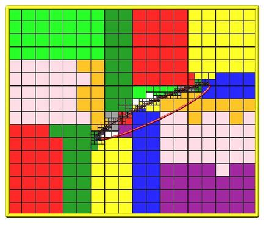

.. index:: balance\_grid

balance\_grid command
=====================

**Syntax:**

.. parsed-literal::

   balance_grid style args ...

* style = *none* or *stride* or *clump* or *block* or *random* or *proc* or *rcb*
  
  .. parsed-literal::
  
       none args = none
       stride args = xyz or xzy or yxz or yzx or zxy or zyx
       clump args = xyz or xzy or yxz or yzx or zxy or zyx
       block args = Px Py Pz
         Px,Py,Pz = # of processors in each dimension
       random args = none 
       proc args = none
       rcb args = weight
         weight = cell or part or time

* zero or more keyword/value(s) pairs may be appended
* keyword = *axes* or *flip*
  
  .. parsed-literal::
  
       axes value = dims
         dims = string with any of "x", "y", or "z" characters in it
       flip value = yes or no

**Examples:**

.. parsed-literal::

   balance_grid block \* \* \*
   balance_grid block \* 4 \*
   balance_grid clump yxz
   balance_grid random
   balance_grid rcb part
   balance_grid rcb part axes xz

**Description:**

This command adjusts the assignment of grid cells and their particles
to processors, to attempt to balance the computational cost (load)
evenly across processors.  The load balancing is "static" in the sense
that this command performs the balancing once, before or between
simulations. The assignments will remain static during the
subsequent run.  To perform "dynamic" balancing, see the :doc:`fix balance <fix_balance>` command, which can adjust the assignemt of
grid cells to processors on-the-fly during a run.

After grid cells have been assigned, they are migrated to new owning
processors, along with any particles they own or other per-cell
attributes stored by fixes.  The internal data structures within
SPARTA for grid cells and particles are re-initialized with the new
decomposition.

This command can be used immediately after the grid is created, via
the :doc:`create\_grid <create_grid>` or :doc:`read\_restart <read_restart>`
commands.  In the former case balance\_grid can be used to partition
the grid in a more desirable manner than the default creation options
allow for.  In the latter case, balance grid can be used to change the
somewhat random assignment of grid cells to processors that will be
made if the restart file is read by a different number of processors
than it was written by.

This command can also be used once particles have been created, or a
simulation has come to equilibrium with a spatially varying density
distribution of particles, so that the computational load is more
evenly balanced across processors.

The details of how child cells are assigned to processors by the
various options of this command are described below.  The cells
assigned to each processor will either be "clumped" or "dispersed".

The *clump* and *block* and *rcb* styles will produce clumped
assignments of child cells to each processor.  This means each
processor's cells will be geometrically compact.  The *stride* and
*random* and *proc* styles will produce dispersed assignments of
child cells to each processor.

IMPORTANT NOTE: See `Section 6.8 <Section_howto.html#howto_8>`_ of the
manual for an explanation of clumped and dispersed grid cell
assignments and their relative performance trade-offs.

----------

The *none* style will not change the assignment of grid cells to
processors.  However it will update the internal data structures
within SPARTA that store ghost cell information on each processor for
cells owned by other processors.  This is useful if the :doc:`global gridcut <global>` command was used after grid cells were already
defined.  That command erases ghost cell information stored by
processors, which then needs to be re-generated before a simulation is
run.  Using the balance\_grid none command will re-generate the ghost
cell information.

The *stride*\ , *clump*\ , and *block* styles can only be used if the grid
is "uniform".  The grid in SPARTA is hierarchical with one or more
levels, as defined by the :doc:`create\_grid <create_grid>` or
:doc:`read\_grid <read_grid>` commlands.  If the parent cell of every
grid cell is at the same level of the hierarchy, then for purposes of
this command the grid is uniform, meaning the collection of grid cells
effectively form a uniform fine grid overlaying the entire simulation
domain.

The meaning of the *stride*\ , *clump*\ , and *block* styles is exactly
the same as when they are used as keywords with the
:doc:`create\_grid <create_grid>` command.  See its doc page for details.

The *random* style means that each grid cell will be assigned
randomly to one of the processors.  Note that in this case every
processor will typically not be assigned the exact same number of
cells.

The *proc* style means that each processor will choose a random
processor to assign its first grid cell to.  It will then loop over
its grid cells and assign each to consecutive processors, wrapping
around the enumeration of processors if necessary.  Note that in this
case every processor will typically not be assigned exactly the same
number of cells.

The *rcb* style uses a recursive coordinate bisectioning (RCB)
algorithm to assign spatially-compact clumps of grid cells to
processors.  Each grid cell has a "weight" in this algorithm so that
each processor is assigned an equal total weight of grid cells, as
nearly as possible.

If the *weight* argument is specified as *cell*\ , then the weight for
each grid cell is 1.0, so that each processor will end up with an
equal number of grid cells.

If the *weight* argument is specified as *part*\ , then the weight for
each grid cell is the number of particles it currently owns, so that
each processor will end up with an equal number of particles.

If the *weight* argument is specified as *time*\ , then timers are used
to estimate the cost of each grid cell.  The cost from the timers is
given on a per processor basis, and then assigned to grid cells by
weighting by the relative number of particles in the grid cells. If no
timing data has yet been collected at the point in a script where this
command is issued, a *cell* style weight will be used instead of
*time*\ .  A small warmup run (for example 100 timesteps) can be used
before the balance command so that timer data is available. The timers
used for balancing tally time from the move, sort, collide, and modify
portions of each timestep.

IMPORTANT NOTE: The :doc:`adapt\_grid <adapt_grid>` command zeros out
timing data, so the weight *time* option is not available immediatly
after this command.

IMPORTANT NOTE: The coarsening option in :doc:`fix\_adapt <fix_adapt>` may
shift cells to different processors, which makes the accumulated
timing data for the weight *time* option less accurate when load
balancing is performed immediately after this command.

Here is an example of an RCB partitioning for 24 processors, of a 2d
hierarchical grid with 5 levels, refined around a tilted ellipsoidal
surface object (outlined in pink).  This is for a *weight cell*
setting, yielding an equal number of grid cells per processor.  Each
processor is assigned a different color of grid cells.  (Note that
less colors than processors were used, so the disjoint yellow cells
actually belong to three different processors).  This is an example of
a clumped distribution where each processor's assigned cells can be
compactly bounded by a rectangle.  Click for a larger version of the
image.

----------

The optional keywords *axes* and *flip* only apply to the *rcb*
style.  Otherwise they are ignored.

The *axes* keyword allows limiting the partitioning created by the RCB
algorithm to a subset of dimensions.  The default is to allow cuts in
all dimension, e.g. x,y,z for 3d simulations.  The dims value is a
string with 1, 2, or 3 characters.  The characters must be one of "x",
"y", or "z".  They can be in any order and must be unique.  For
example, in 3d, a dims = xz would only partition the 3d grid only in
the x and z dimensions.

The *flip* keyword is useful for debugging.  If it is set to *yes*
then each time an RCB partitioning is done, the coordinates of grid
cells will (internally only) undergo a sign flip to insure that the
new owner of each grid cell is a different processor than the previous
owner, at least when more than a few processors are used.  This will
insure all particle and grid data moves to new processors, fully
exercising the rebalancing code.

----------

**Restrictions:**

This command can only be used after the grid has been created by the
:doc:`create\_grid <create_grid>`, :doc:`read\_grid <read_grid>`, or
:doc:`read\_restart <read_restart>` commands.

This command also initializes various options in SPARTA before
performing the balancing.  This is so that grid cells are ready to
migrate to new processors.  Thus if an error is flagged, e.g. that a
simulation box boundary condition is not yet assigned, that operation
needs to be performed in the input script before balancing can be
performed.

**Related commands:**

:doc:`fix balance <fix_balance>`

**Default:**

The default settings for the optional keywords are axes = xyz, flip =
no.

.. _sws: https://sparta.github.io
.. _sd: Manual.html
.. _sc: Section_commands.html
