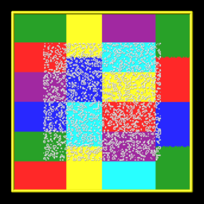
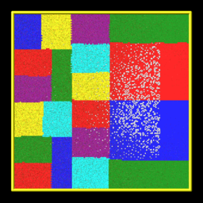
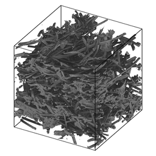
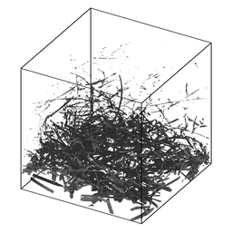
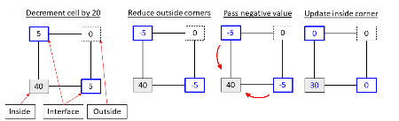
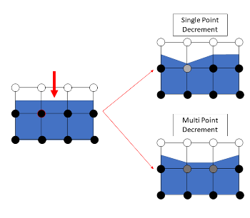

.. index:: fix ablate

fix ablate command
==================

**Syntax:**

.. parsed-literal::

   fix ID ablate group-ID Nevery scale source maxrandom keyword value ...

* ID is documented in :doc:`fix <fix>` command
* ablate = style name of this fix command
* group-ID = ID of group of grid cells that contain implicit surfaces
* Nevery = perform ablation once every Nevery steps
* scale = scale factor to convert source to grid corner point value decrement
* source = computeID or fixID or uniform or random
  
  .. parsed-literal::
  
       computeID = c_ID or c_ID[n] for a compute that calculates per grid cell values
       fixID = f_ID or f_ID[n] for a fix that calculates per grid cell values
       v_name = per-grid vector calculated by a grid-style variable with name
       uniform = perform a uniform decrement
       random = perform a random decrement

* maxrandom = maximum per grid cell decrement as an integer (only specified if source = random or uniform)
* zero or more keyword/value pairs may be appended
* keyword = *mindist* or *multiple* or *conserve*
  
  .. parsed-literal::
  
       mindist value = fraction
         fraction = minimum fractional distance along cell edge for triangle/line vertices (value > 0 and < 0.5)
       multiple value = yes or no
       conserve value = yes or no

**Examples:**

.. parsed-literal::

   fix 1 ablate surfcells 1000 10.0 c_tally
   fix 1 ablate surfcells 0 0.0 random 10
   fix fablate ablate inner 0 0.2 random 0 mindist 0.02

**Description:**

Perform ablation once every Nevery steps on a set of grid cell corner
points to induce new implicit surface elements in those grid cells.
This command is also used as an argument to the
:doc:`read\_isurf <read_isurf>` command so that the grid corner point
values it reads from a file can be assigned to and stored by each grid
cell.

Here are simulation snapshots of 2d and 3d implicit surface models
through which particles flow.  Click on any image for a larger image.
The 1st and 3rd images are the initial states of the porous media.
The 2nd and 4th images are snapshots midway through an ablation
simulation.  In the 2d case, the colorings are by processor for
sub-domains each owns.  Particles flow from left to right.  The
implicit triangles for the 3d case were created via Marching Cubes
(discussed on the :doc:`read\_isurf <read_isurf>` command doc page) from
a tomographic image of a sample of NASA FiberForm (TM) material, used
as a heat shield material on spacecraft.  Particles flow from top to
bottom.

The specified *group-ID* must be the name of a grid cell group, as
defined by the :doc:`group grid <group>` command, which contains a set
of grid cells, all of which are the same size, and which comprise a
contiguous 3d array.  It must be the same as group-ID used with the
:doc:`read\_isurf <read_isurf>` command, which specifies its *Nx* by *Ny*
by *Nz* extent.  See the :doc:`read\_isurf <read_isurf>` command for more
details.  This command reads the initial values for grid cell corner
points, which are stored by this fix.

The specfied *Nevery* determines how often an ablation operation is
performed.  If *Nevery* = 0, ablation is never performed.  The grid
cell corner point values and the surface elements they induce will
remain static for the duration of subsequent simulations.

The specified *scale* is a pre-factor on the specified *source* of
ablation strength.  It converts the per grid cell numeric quantities
produced by the *source* (which may have associated units) to a
unitless decrement value for the grid cell corner points, which range
from 0 to 255 inclusive.  A value of 255 represents solid material and
a value of 0 is void (flow volume for particles).  Values in between
represent partially ablated material.

The *source* can be specified as a per grid cell quantity calculated
by a compute, fix, or variable.  For example, :doc:`compute isurf/grid <compute_isurf_grid>` can tally the number of collisions
of particles with the surfaces in each grid cell or the amount of
energy transferred to the surface by the collisions.  Or :doc:`compute react/isurf/grid <compute_isurf_grid>` can tally the number of
reactions that remove a species from the surface.

An example of a fix which be used as a *source* is :doc:`fix ave/grid <fix_ave_grid>` which could use either of those per grid
cell computes as input.  It could thus accumulate and time average the
same quantities over many timesteps.  In that case the *scale* factor
should account for applying a time-averaged quantity at an interval of
*N* steps.

Finally, a grid-style variable can be be used as a *source*\ .  This
could perform a calculation on other per grid cell quantities.  For
example, it could add and subtract columns from the compute or fix
just mentioned to tally adsorption versus desorption reactions and
thus infer net mass removed from the surface.

For debugging purposes, the *source* can also be specified as *random*
with an additional integer *maxrandom* value also specified.  In this
case, the *scale* factor should be floating point value between 0.0
and 1.0.  Each time ablation is performed, two random numbers are
generated for each grid cell.  The first is a random value between 0.0
and 1.0.  The second is a random integer between 1 and maxrandom.  If
the first random # < *scale*\ , then the second random integer is the
decrement value for the cell.  Thus *scale* is effectively the
fraction of grid cells whose corner point values are decremented.

For basic testing of new ablation capabilities or geometries, the
*source* can be specified as *uniform*\ . Any cell which contains part
of the gas and the surface is decremented by *maxrandom*\ .

See the explanation for the optional *mindist* and *multiple* keywords
below.

----------

Here is an example of commands that will couple ablation to surface
reaction statistics to modulate ablation of a set of implicit
surfaces.  These lines are taken from the
examples/ablation/in.ablation.3d.reactions input script:

.. parsed-literal::

   surf_collide	    1 diffuse 300.0 1.0
   surf_react	      2 prob air.surf

   compute             10 react/isurf/grid all 2
   fix                 10 ave/grid all 1 100 100 c_10[\*]
   dump                10 grid all 100 tmp.grid id c_10[1]

   global              surfs implicit
   fix                 ablate ablate all 100 2.0 c_10[1]   # could be f_10
   read_isurf          all 20 20 20 binary.21x21x21 99.5 ablate

   surf_modify         all collide 1 react 2

The order of these commands matter, so here is the explanation.

The :doc:`surf\_modify <surf_modify>` command must come after the
:doc:`read\_isurf <read_isurf>` command, because surfaces must exist
before assigning collision and reaction models to them.  The :doc:`fix ablate <fix_ablate>` command must come before the
:doc:`read\_isurf <read_isurf>` command, since it uses the ID of the :doc:`fix ablate <fix_ablate>` command as an argument to create implicit surfaces.
The :doc:`fix ablate <fix_ablate>` command takes a compute or fix as an
argument, in this case the ID of the :doc:`compute react/isurf/grid <compute_react_isurf_grid>` command.  This is to
specify what calculation drives the ablation.  In this case, it is the
:doc:`compute react/isurf/grid <compute_react_isurf_grid>` command (or
could be the :doc:`fix ave/grid <fix_ave_grid>` command) which tallies
counts of surface reactions for implicit triangles in each grid cell.
The :doc:`compute react/isurf/grid <compute>` react/isurf/grid command
requires the ID of a surface reaction model, so that it knows the list
of possible reactions to tally.  In this case the reaction is set by
the :doc:`surf\_react <surf_react>` command, which must therefore comes
near the beginning of this list of commands.

----------

As explained on the :doc:`read\_isurf <read_isurf>` doc page, the
marching cubes (3d) or marching squares (2d) algorithm is used to
convert a set of grid corner point values to a set of implicit
triangles in each grid cell which represent the current surface of
porous material which is undergoing dynamic ablation.  This uses a
threshold value, defined by the :doc:`read\_isurf <read_isurf>` command,
to set the boundary between solid material and void.

The ablation operation decrements the corner point values of each grid
cell containing porous material.  The marching cubes or squares
algorithm is re-invoked on the new corner point values to create a new
set of implicit surfaces, which effectively recess due to the
decrement produced by the ablative *source* factor.

The manner in which the per-grid source decrement value is applied to
the grid corner points is as follows.  Note that each grid cell has 4
(2d) or 8 (3d) corner point values.  Except at the boundary of the 2d
of 3d array of grid cells containing porous materials, each corner
point is similarly shared by 4 (2d) or 8 (3d) grid cells.

Within each grid cell, the decrement value is subtracted from the
smallest corner point value.  Except that a corner point value cannot
become smaller than 0.0.  If this would occur, only a portion of the
decrement is used to set the corner point to 0.0; the remainder is
applid to the next smallest corner point value.  And so forth on
successive corner points until all of the decrement is used.  If the
corner point values of the cell sum to less than its decrement value,
they are all set to 0.0 and the rest of the decrement is dropped, since
the cell has no material left to remove.  The dropped amount is
reported; see the discussion of the global vector below.

The amount of decrement applied to each corner point is next shared
between all the grid cells (4 or 8) sharing each corner point value.
The sum of those decrements is subtracted from the corner point,
except that it's final value is set no smaller than 0.0.  All the
copies of each corner point value are now identical.

Several grid cells can decrement the same corner point in one ablation
operation by more than its value, in which case each of them removes
the fraction of that value its own decrement asked for, and the part of
their decrements which the corner point could not cover is offered to
the other corner points of their own cells, repeating the two steps
above.  A grid cell whose decrement is fully applied in the first pass,
which is the usual case, is not affected.

----------

One issue with the marching cubes or squares algorithm is that it can
produce very tiny triangles (3d) or line segments (2d) when grid
corner point values are equal to or very close to the threshold value.

To avoid this problem, the default behavior of this fix is to use an
"epsilon method" to adjust a grid corner point value.  If the corner
point has a value X where threshold-epsilon < X < threshold+epsilon,
then it is reset to a value = threshold-epsilon.  As explained above,
the threshold value is defined by the :doc:`read\_isurf <read_isurf>`
command.  Epsilon is set within the code to be 1.0e-4.  Note that this
is on the scale of corner point values which can range from 0 to 255.

An alternate method for avoiding tiny triangles or line segments is to
use the *mindist* keyword.  For 3d models, its *fraction* value sets
the minimum fractional distance between any vertex of a triangle
generated by the marching cubes algorithm and any of the 8 corner
points of the grid cell.  For 2d models, it sets the minimum
fractional distance between any end point of a line segment generated
by the marching squares algorithm and any of the 4 corner points of
the grid cell.  Fractional means relative to the grid 
cell edge length.  I.e. if the grid cell size is 2.0 and *fraction* is 
0.1, then the fractional distance is 0.2.

The specified *fraction* value must be a number >= 0.0 and < 0.5.  If
the value is less than 1.0e-4, then it is treated as if the value were
0.0 (the default), and the epsilon method described above is used.

For values of fraction >= 1.0e-4, the "isosurface stuffing" method
proposed by Labelle and Shewchuk `(Labelle07) <#Labelle07>`_ is used.
The idea is as follows:

If a generated triangle vertex or line segment end point could be
geometrically closer to a grid corner point than *fraction*\ , the
vertex location is adjusted to ensure the vertex/end-point will always
be at least a distance *fraction* from the corner point and remains
between the same inside and outside grid corner points.  The grid
point values themselves are not changed.  There are two cases to
consider.

\(1) The vertex is too close to a inside grid corner point. In this
case, the vertex location is shifted towards the outside corner point
such that the relative distance from the vertex to the inside corner
point is at least *mindist*

\(2) Conversely, if the vertex is too close to the outside grid corner
point, the vetex location is shifted towards the inside corner point
such that the relative distance from the vertex to the outside corner
point is at least *mindist*

----------

The *multiple* option allows a multipoint decrement `(Hong24) <#Hong24>`_ to be used. 
In a cell, three types of corners are identified: inside, outside or
interface.  An **inside** point is a point inside the surface (its
values is greater than the specified threshold).  An **outside** point
is a point that is outside the surface and all corner points adjacent
to that corner point within the cell are also outside the surface.  An
**interface** is a point outside the surface but one of its neighboring
points is inside. Given a cell decrement, the multipoint decrement
distributes that cell decrement evenly to each interface point. In the
case the interface point becomes negative, the negative value is
evenly distributed to each of the adjoining inside points. The
multipoint decrement may also be used with the multivalues.

The multipoint decrement is conceptually different than the single
point decrement.  A single point decrement visits each corner point
one at a time and reduces the minimum corner point value found.  The
multipoint decrement reduces all interface points. A distributed
decrement is advantageous when one is interested in preserving cell
level features. In the above example, a single cell is ablated
(indicated by a red arrow). With a single point decrement, only one
corner point is updated and only the left side of the affected cell
ablates. With the multipoint decrement, two corner points are reduced
and the entire surface contained within the ablated cell recedes.

----------

**Restart, output info:**

No information about this fix is written to :doc:`binary restart files <restart>`.

This fix computes a global scalar and a global vector of length 3.
The global scalar is the current sum of unique corner point values
across the entire grid (not counting duplicate values).  This sum
assumes that corner point values are 0.0 on the boundary of the 2d or
3d array of grid cells containing implicit surface elements.

The 3 vector values are the (1) sum of decrement values for each grid
cell in the most recent ablation operation, (2) the # of particles
deleted during the most recent ablation operation that ended up
"inside" the newly ablated surface, and (3) the cumulative amount of
requested decrement which the corner point values could not pay.  The
second quantity should be 0.  A non-zero value indicates a corner case
in the marching cubes or marching squares algorithm the developers
still need to address.

The third quantity is normally 0.0 as well.  It becomes non-zero when a
grid cell is asked to remove more material in one ablation operation
than the sum of its corner point values, as described above.  That is
expected for the *random* and *uniform* sources, which keep asking after
a cell is empty, but for a *c\_ID* or *f\_ID* source it means the ablative
source removed less material than it accounted for, e.g. surface
chemistry created gas products for solid material that was never
removed.  A warning is printed the first time it happens.  Note that
this quantity is tallied for the single point decrement only.  With the
*multiple* keyword the deficit is instead passed to the inside corner
points, which are clamped at 0.0, and only a warning is printed.

The *conserve* keyword applies to the single point decrement only.  With
*conserve* set to yes, the default, a grid cell whose claim on a shared
corner point was reduced because a neighbor cell claimed the same point
in this ablation operation is offered the remainder of its claim again,
from the other corner points of the same cell.  This is what makes the
third vector value above account for the requested decrement exactly.
An ablation operation which pays every claim in full stops after the
first decrement, so a run that never over-claims a corner point costs
nothing extra; one that cannot pay in full runs a second decrement to
find that nothing more can be removed, which is a second round of corner
point communication.  Setting *conserve* to no stops after the first
decrement, so a claim a shared corner point could not cover is dropped
and reported rather than retried.

For the single point decrement the sum of this quantity and the removed
corner point values accounts for the requested decrement exactly, so it
is the only decrement which is not applied.  It means the *source* asked
to remove material from a grid cell which has none left, so the two are
inconsistent: with a *c\_ID* or *f\_ID* source the surface chemistry
created gas products for solid material that was not there to remove,
which no accounting inside this fix can repair.

These values can be accessed by any command that uses global values
from a fix as input.  See `Section 6.4 <Section_howto.html#howto_4>`_ for
an overview of SPARTA output options.

The scalar and vector values are unitless.

**Restrictions:**

This fix can only be used in simulations that define implicit surfaces.

All surface elements must be assigned to the same surface collision
model and (optionally) the same surface reaction model via the
:doc:`surf\_modify <surf_modify>` command.  This is because each ablation
operation discards and re-creates all the implicit surface elements,
and this fix re-assigns the same pair of models to all the new
elements.  Assigning different models to different groups of surface
elements is not yet supported with ablation; an error is generated if
that is the case.

**Related commands:**

:doc:`read isurf <read_isurf>`

**Default:**

The default for the *mindist* keyword = 0.0, i.e. the epsilon method
is used.  The default for the *multiple* keyword = no.  The default for
the *conserve* keyword = yes.

----------

.. _Labelle07:

.. raw:: html

   

**(Labelle07)** F. Labelle, and J. R.. Shewchuk, "Isosurface stuffing:
Fast Tetrahedral Meshes with Good Dihedral Angles," SIGGRAPH (2007).

.. _Hong24:

.. raw:: html

   

**(Hong24)** A. Y. K. Hong, M. A. Gallis, S. G Moore, and S. J. Plimpton, "Towards physically realistic ablation modeling in direct simulation Monte Carlo," Physics of Fluids (2024).

.. _sws: https://sparta.github.io
.. _sd: Manual.html
.. _sc: Section_commands.html
